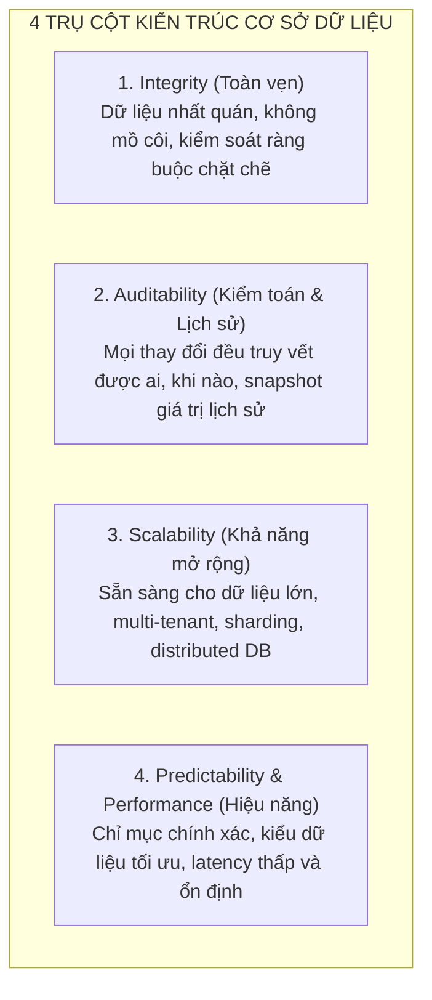
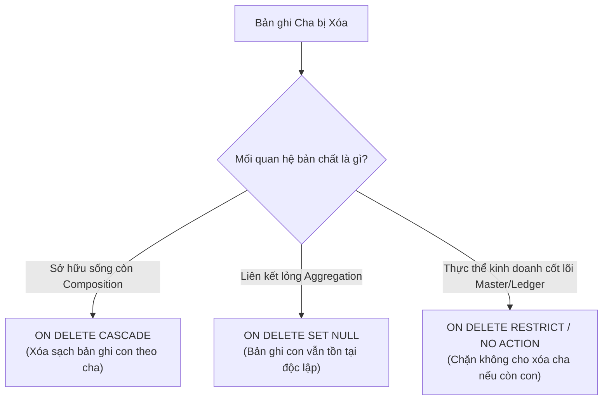
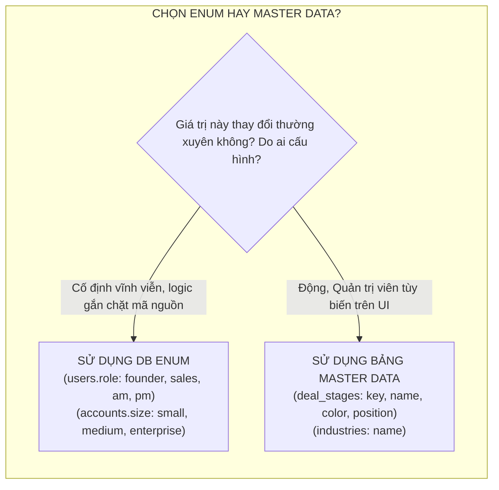
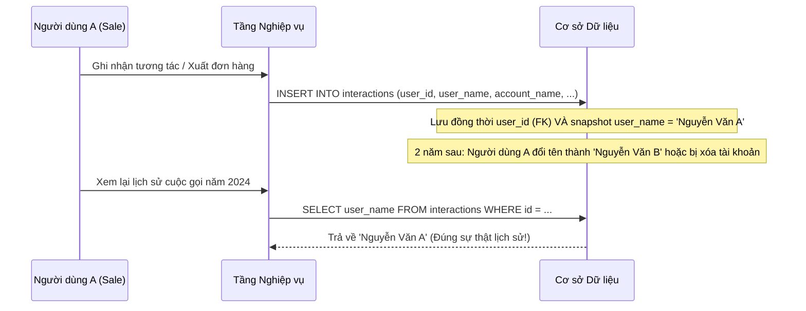
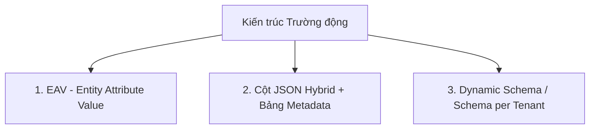
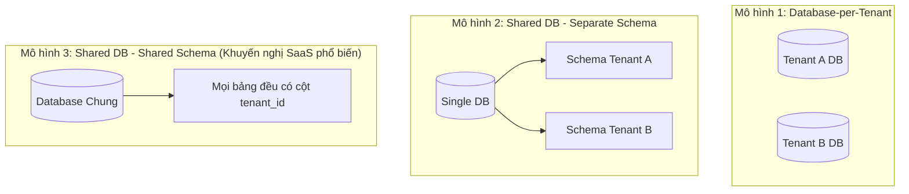
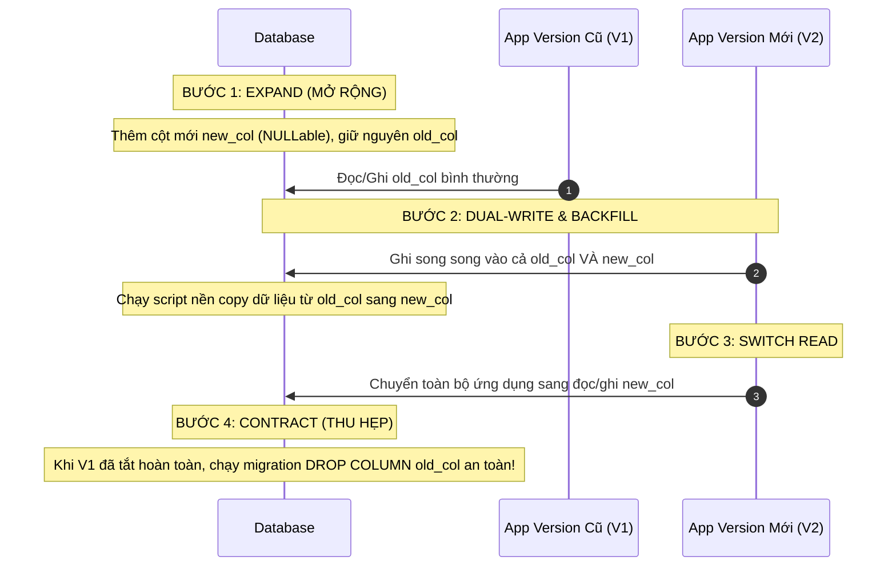

# Hướng Dẫn & Bộ Nguyên Tắc Thiết Kế Cơ Sở Dữ Liệu Toàn Diện (Database Architecture Standard)

> **Tài liệu chuẩn hoá kiến trúc dữ liệu cho đa hệ thống** (CRM, ERP, SaaS Multi-tenant, E-commerce, FinTech, CMS).  
> Kế thừa và mở rộng từ thực tiễn sản xuất của [docs/DATABASE_DESIGN.md](file:///e:/Vietcham_CRM/docs/DATABASE_DESIGN.md) và mã nguồn lõi của hệ thống.  
> Phiên bản chi tiết trong thư mục docs: [docs/data.md](file:///e:/eproject1/docs/data.md).

---

## Mục lục

1. [Tầm nhìn & 4 Trụ cột thiết kế](#1-tầm-nhìn--4-trụ-cột-thiết-kế)
2. [Quy chuẩn định danh & Cấu trúc (Naming Conventions)](#2-quy-chuẩn-định-danh--cấu-trúc-naming-conventions)
3. [Chiến lược Khóa chính (Primary Key - PK)](#3-chiến-lược-khóa-chính-primary-key---pk)
4. [Khóa ngoại & Toàn vẹn tham chiếu (Foreign Keys & Integrity)](#4-khóa-ngoại--toàn-vẹn-tham-chiếu-foreign-keys--integrity)
5. [Kiểu dữ liệu & Tối ưu hóa lưu trữ (Data Types & Storage)](#5-kiểu-dữ-liệu--tối-ưu-hóa-lưu-trữ-data-types--storage)
6. [Quản lý trạng thái: Enums vs Bảng Master Data](#6-quản-lý-trạng-thái-enums-vs-bảng-master-data)
7. [Chuẩn hóa (Normalization) & Phi chuẩn hóa có chọn lọc (Denormalization)](#7-chuẩn-hóa-normalization--phi-chuẩn-hóa-có-chọn-lọc-denormalization)
8. [Chiến lược xóa dữ liệu: Soft Delete, Hard Delete & Archiving](#8-chiến-lược-xóa-dữ-liệu-soft-delete-hard-delete--archiving)
9. [Chiến lược đánh chỉ mục (Indexing) & Tối ưu truy vấn](#9-chiến-lược-đánh-chỉ-mục-indexing--tối-ưu-truy-vấn)
10. [Mở rộng Schema linh hoạt: Custom Fields & Dynamic Schema](#10-mở-rộng-schema-linh-hoạt-custom-fields--dynamic-schema)
11. [Bảo mật, Phân quyền & Kiến trúc Multi-Tenancy](#11-bảo-mật-phân-quyền--kiến-trúc-multi-tenancy)
12. [Tích hợp ngoại vi & Tính lũy đẳng (Integration & Idempotency)](#12-tích-hợp-ngoại-vi--tính-lũy-đẳng-integration--idempotency)
13. [Vòng đời Schema & Quản lý Migration không downtime](#13-vòng-đời-schema--quản-lý-migration-không-downtime)
14. [Mẫu Schema chuẩn & Checklist thẩm định Go-Live](#14-mẫu-schema-chuẩn--checklist-thẩm-định-go-live)

---

## 1. Tầm nhìn & 4 Trụ cột thiết kế

Một cơ sở dữ liệu xuất sắc không chỉ đáp ứng chức năng CRUD trước mắt, mà phải bảo đảm vận hành bền vững trong suốt vòng đời của doanh nghiệp. Mọi quyết định thiết kế schema phải dựa trên 4 trụ cột cốt lõi:



* **Integrity (Toàn vẹn):** Đảm bảo ràng buộc ở tầng vật lý DB trước, tầng ứng dụng chỉ là lớp phòng thủ thứ hai. Không để xảy ra dữ liệu rác, bản ghi con mồ côi hoặc vi phạm logic kinh doanh.
* **Auditability (Khả năng kiểm toán):** Trong các hệ thống thực tế (CRM, ERP, Banking), dữ liệu lịch sử phải bất biến. Dù thông tin gốc (tên khách hàng, đơn giá sản phẩm) bị sửa đổi, các giao dịch/tương tác trong quá khứ vẫn phải phản ánh đúng ngữ cảnh tại thời điểm phát sinh.
* **Scalability (Khả năng mở rộng):** Thiết kế độc lập với ID tự tăng tập trung, sẵn sàng cho phân tán (Sharding/Replication), đa người thuê (Multi-tenancy) mà không cần đập đi xây lại.
* **Predictability & Performance (Độ tin cậy & Hiệu năng):** Mọi truy vấn đọc/ghi có độ phức tạp đo lường được; tận dụng B-Tree Index, hạn chế Full Table Scan, tránh khóa bảng không cần thiết.

---

## 2. Quy chuẩn định danh & Cấu trúc (Naming Conventions)

Sự nhất quán trong định danh giúp giảm 80% lỗi ngớ ngẩn khi viết truy vấn, viết code ORM và tăng tốc onboarding cho đội ngũ kỹ thuật.

### 2.1. Quy tắc bảng (Tables)
* **Ký tự & Casing:** Dùng toàn bộ chữ thường, ngăn cách bằng dấu gạch dưới (`snake_case`). Không dùng khoảng trắng hoặc ký tự đặc biệt.
* **Số nhiều (Plural):** Tên bảng thực thể luôn ở dạng **danh từ số nhiều**.
  * ✅ Chuẩn: `users`, `accounts`, `opportunities`, `tickets`, `invoices`, `order_items`.
  * ❌ Tránh: `user`, `tbl_account`, `Opportunity`, `TicketMaster`.
* **Bảng trung gian quan hệ n-n (Junction / Pivot tables):** Ghép tên hai thực thể số ít hoặc số nhiều theo logic nghiệp vụ rõ ràng:
  * Ví dụ: `contact_accounts` (liên kết contacts và accounts), `opportunity_contacts`, `role_permissions`.
* **Bảng Master Data / Lookup:** Đặt tên rõ nghĩa đại diện cho tập danh mục:
  * Ví dụ: `deal_stages`, `industries`, `ticket_statuses`, `currencies`.

### 2.2. Quy tắc cột (Columns)
* **Casing:** Toàn bộ `snake_case` (ví dụ: `first_name`, `created_at`, `password_hash`).
* **Khóa chính:** Luôn đặt tên là `id`. Tránh đặt `<table_name>_id` ở chính bảng đó (ví dụ: bảng `users` thì cột PK là `id`, KHÔNG đặt là `user_id`).
* **Khóa ngoại (Foreign Keys):** Luôn theo chuẩn `<singular_entity>_id` (ví dụ: `account_id`, `user_id`, `primary_contact_id`).
* **Cột cờ Boolean:** Bắt đầu bằng tiền tố xác định trạng thái logic: `is_`, `has_`, `can_`, `should_`.
  * ✅ Chuẩn: `is_active`, `is_system`, `has_discount`, `can_export`.
  * ❌ Tránh: `active` (dễ lẫn enum/status), `flag`, `status_bool`.
* **Cột mốc thời gian (Timestamps):** Dùng hậu tố `_at`:
  * `created_at`: Thời điểm tạo bản ghi.
  * `updated_at`: Thời điểm cập nhật cuối cùng.
  * `deleted_at`: Thời điểm xóa mềm.
  * `published_at`, `verified_at`, `closed_at`, `expires_at`.
* **Cột ngày tháng thuần túy (Date only):** Dùng hậu tố `_date`:
  * `due_date`, `birth_date`, `expected_close_date`, `project_start_date`.
* **Cột định danh người thao tác:** Dùng hậu tố `_by`:
  * `created_by` (hoặc `created_by_id`), `updated_by`, `deleted_by`.

### 2.3. Quy tắc đặt tên Index & Ràng buộc (Constraints)
| Loại | Cú pháp khuyến nghị | Ví dụ |
| :--- | :--- | :--- |
| **Primary Key** | `pk_<table>` hoặc `<table_name>_pkey` | `pk_users`, `accounts_id` |
| **Foreign Key** | `fk_<table>_<referenced_table>` | `fk_contacts_accounts`, `fk_tickets_users` |
| **Unique Index** | `uk_<table>_<column>` | `uk_users_email`, `uk_accounts_hubspot_id` |
| **Single Index** | `idx_<table>_<column>` | `idx_opportunities_created_at` |
| **Composite Index** | `idx_<table>_<col1>_<col2>` | `idx_tickets_status_created_at` |

---

## 3. Chiến lược Khóa chính (Primary Key - PK)

Việc chọn loại khóa chính định hình toàn bộ khả năng mở rộng, bảo mật và hiệu năng ghi của hệ thống.

### 3.1. Bảng so sánh các giải pháp Khóa chính

| Đặc tính | BIGINT Auto-increment | UUID v4 (Random) | UUID v7 / ULID (Time-sorted) | Snowflake ID (Twitter style) |
| :--- | :--- | :--- | :--- | :--- |
| **Kích thước** | 8 bytes | 16 bytes (hoặc 36 ký tự char) | 16 bytes (hoặc 26/36 ký tự char) | 8 bytes |
| **Sinh ID tại đâu** | Tầng Database | Tầng Ứng dụng (Client/App) | Tầng Ứng dụng (Client/App) | Tầng Ứng dụng / Service riêng |
| **Sắp xếp theo thời gian** | Có (tăng dần) | Không (hoàn toàn ngẫu nhiên) | Có (Timestamp 48-bit ở đầu) | Có |
| **B-Tree Clustered Index** | Tối ưu tuyệt đối, không phân mảnh | Phân mảnh trang đĩa cao (Page splits) | Tối ưu, ghi tuần tự vào cuối index | Tối ưu tuyệt đối |
| **Bảo mật (Chống Enumeration)** | Rất kém (dễ bị đoán ID `orders/1001` -> `1002`) | Rất cao (không thể đoán mò) | Rất cao | Rất cao |
| **Phù hợp phân tán (Sharding)** | Khó (cần quản lý range / sequence) | Tự nhiên, không xung đột | Tự nhiên, không xung đột | Thiết kế riêng cho phân tán |

### 3.2. Khuyến nghị thực chiến cho đa hệ thống

1. **Hệ thống SaaS / CRM / ERP hiện đại (Khuyến nghị chuẩn):**
   * Sử dụng **UUID v7** hoặc **ULID** (lưu dạng `varchar(36)` hoặc `binary(16)`).
   * **Lý do:**
     * Tránh lộ số lượng dữ liệu kinh doanh ra ngoài qua URL/API (tránh leak sequential ID).
     * Cho phép tầng Frontend / Backend tự sinh ID trước khi gửi vào DB (rất quan trọng khi xử lý offline-first, bulk insert, saga transaction, và tạo bản ghi liên kết cha-con cùng lúc).
     * UUID v7 có phần đầu là timestamp nên dữ liệu luôn chèn vào cuối cây B-Tree, triệt tiêu hiện tượng vỡ trang (Page Split) vốn là điểm yếu cố hữu của UUID v4.
2. **Hệ thống chuyên logging / event stream / high-frequency metric:**
   * Sử dụng `BIGINT UNSIGNED AUTO_INCREMENT` hoặc `Snowflake ID` 64-bit để tiết kiệm tối đa dung lượng bộ nhớ đệm RAM và I/O đĩa.
3. **Bảng Master Data (Danh mục tĩnh ít bản ghi):**
   * Có thể dùng `varchar(50)` hoặc `varchar(36)` với khóa logic cố định (ví dụ: `stage = 'proposal'`, `role = 'admin'`).

---

## 4. Khóa ngoại & Toàn vẹn tham chiếu (Foreign Keys & Integrity)

Khóa ngoại là chốt chặn bảo vệ tính toàn vẹn dữ liệu. Tuy nhiên, hành vi xóa (`ON DELETE`) phải được chỉ định có chủ đích:

### 4.1. Quy tắc ứng xử khi xóa (`ON DELETE`)



1. **`ON DELETE CASCADE` (Quan hệ sống còn - Composition):**
   * Áp dụng khi dữ liệu con **vô nghĩa** nếu cha không còn.
   * *Ví dụ thực tế:*
     * `sessions.user_id` → `users.id` (User bị xóa thì phiên đăng nhập phải hủy ngay).
     * `order_items.order_id` → `orders.id` (Chi tiết dòng đơn hàng gắn chặt với đơn hàng).
     * `opportunity_contacts.opportunity_id` → `opportunities.id` (Bảng nối n-n).
2. **`ON DELETE SET NULL` (Quan hệ sở hữu lỏng - Aggregation):**
   * Áp dụng khi bản ghi con là tài sản dữ liệu độc lập, việc cha biến mất chỉ làm trống trường phụ trách.
   * *Ví dụ thực tế:*
     * `contacts.account_id` → `accounts.id` (Công ty bị xóa thì người liên hệ vẫn còn, chuyển sang trạng thái chưa gán công ty).
     * `tickets.assignee_id` → `users.id` (Nhân viên nghỉ việc thì ticket trở về trạng thái unassigned).
     * `interactions.contact_id` → `contacts.id` (Lịch sử trao đổi không được mất, chỉ ngắt liên kết người).
3. **`ON DELETE RESTRICT / NO ACTION` (Quan hệ bảo vệ lịch sử - Protection):**
   * Áp dụng khi tuyệt đối không được để hành vi vô tình của người dùng xóa mất dữ liệu quan trọng.
   * *Ví dụ:* Không cho phép xóa `accounts` nếu công ty đó đã có ít nhất một `invoices` (hóa đơn) hợp lệ. Phải lưu trữ hoặc hủy hóa đơn trước.

### 4.2. Khóa ngoại vật lý (Physical FK) vs Tham chiếu Logic (Logical FK)
* **Khóa ngoại vật lý (DB Constraints):**
  * Luôn ưu tiên dùng trong monolithic app, ứng dụng có một database tập trung (CRM, Web SaaS vừa và nhỏ).
  * Giúp DB tự động kiểm tra tính hợp lệ, ngăn ngừa lỗi code vô tình chèn ID không tồn tại.
* **Tham chiếu Logic (Code-level Integrity):**
  * Dùng khi:
    * Liên kết qua ranh giới dịch vụ khác nhau (Microservices / Database-per-service).
    * Bảng Master Data cho phép tuỳ biến mềm linh hoạt (ví dụ: `opportunities.stage` tham chiếu tới `deal_stages.key` dưới dạng chuỗi, tránh lock bảng khi admin sửa đổi danh mục).
    * Dữ liệu Partitioning hoặc Sharding nơi foreign key xuyên node không được hỗ trợ bởi DB engine.

---

## 5. Kiểu dữ liệu & Tối ưu hóa lưu trữ (Data Types & Storage)

Chọn sai kiểu dữ liệu là nguyên nhân hàng đầu gây sai lệch số liệu tài chính, phình to bộ nhớ đệm và suy giảm hiệu năng.

### 5.1. Bảng quy chuẩn lựa chọn kiểu dữ liệu

| Loại dữ liệu | Kiểu dữ liệu chuẩn | Kiểu cấm kỵ / Cảnh báo | Lý do & Nguyên tắc áp dụng |
| :--- | :--- | :--- | :--- |
| **Tiền tệ & Số dư** | `DECIMAL(15, 2)` hoặc `DECIMAL(18, 4)` | ❌ `FLOAT`, `DOUBLE` | Tuyệt đối không dùng dấu phẩy động cho tiền tệ vì lỗi làm tròn nhị phân (Binary floating point inaccuracy). |
| **Tỷ lệ phần trăm** | `DECIMAL(5, 2)` hoặc `INT` (0–100) | ❌ `FLOAT` | Rõ ràng về miền giá trị (ví dụ: xác suất chốt deal 0–100%). |
| **Chuỗi ngắn** | `VARCHAR(50)` đến `VARCHAR(255)` | ❌ `CHAR(255)`, `TEXT` cho trường ngắn | Khai báo độ dài có ý nghĩa thực tế (email: 255, phone: 50, slug: 255). |
| **Văn bản dài** | `TEXT`, `MEDIUMTEXT`, `LONGTEXT` | ❌ Lạm dụng `VARCHAR(10000)` | Văn bản mô tả, ghi chú tự do, mã HTML bài viết. |
| **Cờ logic** | `BOOLEAN` (hoặc `TINYINT(1)`) | ❌ `VARCHAR(1)` ('Y'/'N'), `INT` | Chuẩn hoá logic true/false, tiết kiệm dung lượng. |
| **Ngày giờ hệ thống** | `TIMESTAMP` hoặc `DATETIME` | ❌ Lưu chuỗi String `VARCHAR(20)` | Luôn lưu giờ chuẩn **UTC** ở tầng DB. Format timezone tại client. |
| **Ngày thuần túy** | `DATE` | ❌ Chèn giờ 00:00:00 vào Timestamp | Áp dụng cho ngày sinh, ngày bắt đầu dự án, kỳ hạn hóa đơn. |
| **Dữ liệu cấu trúc linh hoạt**| `JSON` (hoặc `LONGTEXT` tương thích) | ❌ Dùng JSON cho trường cần JOIN thường xuyên | Chỉ dùng cho metadata, snapshot config, custom attributes phụ trợ. |

### 5.2. Bảng mã và Collation (Charset & Collation)
* Luôn sử dụng **`utf8mb4`** với collation **`utf8mb4_unicode_ci`** (hoặc `utf8mb4_0900_ai_ci` trên MySQL 8).
* **Lý do:** Hỗ trợ đầy đủ tiếng Việt có dấu, ký tự đa ngôn ngữ (Nhật, Hàn, Trung) và biểu tượng Emoji. Nếu dùng `utf8` cũ (chỉ 3 bytes), hệ thống sẽ sập hoặc văng lỗi khi người dùng nhập icon/emoji từ điện thoại.

### 5.3. Bài học thực tiễn về JSON giữa MySQL và MariaDB
* **Vấn đề thực tế:** MariaDB (phiên bản 10.4–11.x) coi kiểu `JSON` thực chất là alias của `LONGTEXT` kèm một ràng buộc `CHECK (json_valid(...))` tự sinh. Các công cụ Migration (như Drizzle Kit) có thể bị crash khi gặp check constraint ẩn này lúc đọc metadata schema.
* **Giải pháp chuẩn hoá đa hệ thống:** Khi cần hỗ trợ tương thích cao giữa MySQL và MariaDB, có thể cấu hình cột lưu JSON ở tầng vật lý là `LONGTEXT` và dùng custom type / interceptor ở tầng ORM để `JSON.stringify` khi ghi và `JSON.parse` khi đọc.

---

## 6. Quản lý trạng thái: Enums vs Bảng Master Data

Cách quản lý các trường phân loại (`status`, `role`, `stage`, `category`) quyết định độ linh hoạt và tính bảo trì của hệ thống.



### 6.1. Khi nào dùng DB `ENUM`?
* **Đặc điểm:** Tập giá trị nhỏ, bất biến trong nghiệp vụ, logic code backend phụ thuộc trực tiếp vào từng giá trị (hardcoded switch-case).
* **Ưu điểm:** Tiết kiệm dung lượng, DB tự validate tính hợp lệ, không cần JOIN bảng phụ.
* **Ví dụ:**
  * `role`: `founder`, `sales`, `am`, `pm`, `accounting`.
  * `account_type`: `end-client`, `partner`, `consultant`.
  * `ticket_priority`: `low`, `medium`, `high`, `urgent`.

### 6.2. Khi nào dùng Bảng Master Data / Lookup Table?
* **Đặc điểm:** Cần hỗ trợ người dùng cuối hoặc Admin thêm/sửa/đổi thứ tự/đổi màu sắc hiển thị trên giao diện mà không cần can thiệp code hay chạy database migration.
* **Cấu trúc bảng Master Data tiêu chuẩn:**
  ```sql
  CREATE TABLE deal_stages (
      id VARCHAR(36) PRIMARY KEY,
      key VARCHAR(50) NOT NULL UNIQUE,       -- Khóa logic để code định danh (vd: 'won', 'lost')
      name_vi VARCHAR(100) NOT NULL,          -- Hỗ trợ đa ngôn ngữ hiển thị
      name_en VARCHAR(100) NOT NULL,
      color VARCHAR(30) NOT NULL DEFAULT '#94a3b8',
      position INT NOT NULL DEFAULT 0,        -- Sắp xếp thứ tự kéo thả Kanban
      is_system BOOLEAN NOT NULL DEFAULT false, -- True: Không cho phép người dùng xóa
      is_active BOOLEAN NOT NULL DEFAULT true,
      created_at TIMESTAMP NOT NULL DEFAULT CURRENT_TIMESTAMP,
      updated_at TIMESTAMP NOT NULL DEFAULT CURRENT_TIMESTAMP ON UPDATE CURRENT_TIMESTAMP
  );
  ```

---

## 7. Chuẩn hóa (Normalization) & Phi chuẩn hóa có chọn lọc (Denormalization)

Chuẩn hóa dữ liệu (3NF) giúp triệt tiêu dữ liệu thừa và tránh dị thường (Anomalies). Nhưng trong hệ thống thực tế phục vụ người dùng, **phi chuẩn hóa có chọn lọc (Selective Denormalization)** là vũ khí then chốt để bảo vệ tính toàn vẹn lịch sử và tối ưu hiệu năng đọc.

### 7.1. Mẫu hình Lưu vết Lịch sử (Snapshotting Pattern)

> **Nguyên tắc vàng:** "Dữ liệu giao dịch trong quá khứ phải bất biến trước sự thay đổi của danh mục hiện tại."

Hãy xem xét bảng tương tác khách hàng (`interactions`), hóa đơn (`invoices`), hoặc đơn hàng (`orders`):



* **Phân tích rủi ro nếu chỉ thuần túy chuẩn hóa (Pure 3NF):**
  * Nếu bảng `interactions` chỉ lưu `user_id` trỏ về `users(id)`: Khi nhân viên nghỉ việc và bị xóa tài khoản, toàn bộ lịch sử trao đổi biến thành "Người dùng vô danh" hoặc `NULL`.
  * Nếu khách hàng đổi tên công ty từ "Công ty A" sang "Công ty B", toàn bộ báo cáo lịch sử 5 năm trước cũng bị đổi tên theo, gây sai lệch báo cáo kiểm toán pháp lý.
* **Cách triển khai chuẩn:**
  * Bảng `interactions`: Lưu `user_id` (FK) + `user_name` (snapshot), `contact_id` (FK) + `contact_name` (snapshot).
  * Bảng `order_items`: Lưu `product_id` (FK) + `product_name` (snapshot) + `unit_price` (snapshot giá tại thời điểm mua).

### 7.2. Counter Caches & Pre-computed Fields
* Khi tần suất đọc lớn hơn hàng nghìn lần tần suất ghi, tính toán lại toàn bộ dữ liệu aggregation (như tổng doanh thu, số lượng ticket đang mở, ngày tương tác gần nhất `last_interaction_date`) trên mỗi lượt view sẽ làm sập DB.
* **Giải pháp:** Lưu cột tổng hợp trực tiếp trên thực thể cha (`accounts.last_interaction_date`, `accounts.total_open_deals`). Cập nhật thông qua Event / Background Job / Transaction khi có bản ghi con phát sinh.

---

## 8. Chiến lược xóa dữ liệu: Soft Delete, Hard Delete & Archiving

Dữ liệu doanh nghiệp là tài sản. Xóa nhầm dữ liệu có thể dẫn tới thiệt hại tài chính và pháp lý nghiêm trọng.

### 8.1. So sánh 3 mô hình Soft Delete

| Mô hình | Cách thiết kế cột | Ưu điểm | Nhược điểm & Thách thức |
| :--- | :--- | :--- | :--- |
| **Cách 1: Timestamp** | `deleted_at TIMESTAMP NULL` | Biết chính xác thời điểm xóa. Dễ viết query: `WHERE deleted_at IS NULL`. | Xử lý Unique Constraint phức tạp trên MySQL/MariaDB. |
| **Cách 2: Lifecycle Status** | `status ENUM('active', 'inactive', 'deleted')` | Trực quan hóa quy trình kinh doanh (chờ duyệt, hoạt động, ngừng hoạt động, đã xóa). | Phải kèm `status = 'active'` ở hầu hết câu query. |
| **Cách 3: Boolean Flag** | `is_deleted BOOLEAN DEFAULT false` | Đơn giản, trực quan. | Không biết ai xóa, xóa lúc nào; cùng thách thức với Unique Key. |

### 8.2. Giải quyết bài toán hóc búa: Unique Constraint kết hợp Soft Delete
* **Tình huống:** Bảng `users` hoặc `contacts` có cột `email` là UNIQUE. Người dùng A (`email = 'ceo@company.com'`) bị soft delete (`deleted_at = '2026-01-01'`). Sau đó, công ty tuyển CEO mới có cùng email này. Nếu dùng UNIQUE trên cột `email`, câu lệnh tạo mới sẽ báo lỗi vi phạm trùng lặp!
* **Các phương án giải quyết chuẩn:**
  1. **Tạo Composite Unique Index:**
     * Trên PostgreSQL: Tạo Partial Unique Index:
       ```sql
       CREATE UNIQUE INDEX uk_users_email ON users(email) WHERE deleted_at IS NULL;
       ```
     * Trên MySQL/MariaDB (không hỗ trợ partial index): Thêm cột phụ `active_email` (Virtual Generated Column): Nếu bản ghi active thì giữ nguyên email, nếu deleted thì gán `NULL` (vì MySQL cho phép nhiều giá trị NULL trong Unique Index).
  2. **Giải pháp Đổi tên khi xóa (Scramble on Soft Delete):**
     * Khi soft delete: Cập nhật `email = CONCAT(email, '_deleted_', UNIX_TIMESTAMP())`.
  3. **Tách riêng bảng Archive:**
     * Bảng chính chỉ chứa dữ liệu active (đảm bảo Unique sạch 100%). Khi xóa thì INSERT sang bảng `contacts_archived` và DELETE khỏi bảng chính trong một transaction.

### 8.3. Cascade Soft Delete & Chính sách Lưu trữ (Purge/Archival)
* **Quy tắc Cascade:** Khi soft delete một `account`, ứng dụng phải có logic cập nhật đồng thời hoặc đánh dấu các bản ghi liên quan (hoặc kiểm tra ràng buộc trước khi cho phép xóa).
* **Chính sách Hard Purge:** Xây dựng Cron Job định kỳ dọn dẹp các bản ghi soft-deleted quá hạn (ví dụ: sau 90 ngày) chuyển vào Cold Storage (S3 / Parquet data warehouse) để tuân thủ quyền riêng tư (GDPR) và thu hồi dung lượng đĩa.

---

## 9. Chiến lược đánh chỉ mục (Indexing) & Tối ưu truy vấn

Index là con dao hai lưỡi: Tăng tốc độ đọc gấp hàng nghìn lần, nhưng làm chậm tốc độ ghi (`INSERT`, `UPDATE`, `DELETE`) và tiêu tốn dung lượng RAM.

### 9.1. Quy tắc ESR trong thiết kế Composite Index
Khi thiết kế Composite Index cho các truy vấn phức tạp có nhiều điều kiện `WHERE`, `ORDER BY`, hãy tuân thủ thứ tự **ESR (Equality -> Sort -> Range)**:

```
[1. Equality]  ->  [2. Sort]  ->  [3. Range]
 (=, IS NULL)       (ORDER BY)     (>, <, BETWEEN, LIKE)
```

* **Ví dụ:** Hệ thống cần lọc danh sách ticket:
  ```sql
  SELECT * FROM tickets 
  WHERE account_id = 'acc_123'         -- [Equality]
    AND priority = 'high'              -- [Equality]
    AND created_at >= '2026-01-01'     -- [Range]
  ORDER BY created_at DESC;            -- [Sort]
  ```
  👉 **Index tối ưu nhất:** `(account_id, priority, created_at)`.  
  Nếu đặt `created_at` lên trước `priority`, DB sẽ chỉ dùng được index cho phần `account_id` và `created_at`, phần `priority` sẽ phải quét từng dòng!

### 9.2. Danh mục cột BẮT BUỘC phải có Index
1. **Khóa ngoại (Foreign Keys):** Mọi cột `*_id` trỏ sang bảng khác (`account_id`, `owner_id`, `user_id`). Thiếu index ở đây sẽ khiến các phép `JOIN` và các lệnh xóa cha kiểm tra khóa ngoại bị treo vì Full Table Scan!
2. **Khóa duy nhất kinh doanh (Business Unique Keys):** `email`, `slug`, `code`, `tax_number`, `token`.
3. **Cột lọc trạng thái thường xuyên:** `status`, `stage` (thường kết hợp với `created_at` thành Composite Index).
4. **Cột sắp xếp phân trang:** `created_at`, `updated_at`.
5. **Cột tích hợp bên thứ ba:** `hubspot_id`, `stripe_customer_id`, `gmail_message_id`.

### 9.3. Covering Index (Index-Only Scan)
* Nếu một truy vấn chỉ đọc các cột đã có sẵn bên trong Index Tree mà không cần nhảy vào khối dữ liệu chính trên đĩa (Clustered Data Blocks), tốc độ phản hồi sẽ đạt mức cực đại (tính bằng micro-giây).
* *Ví dụ:* `CREATE INDEX idx_users_active_email ON users(is_active, email);`  
  Truy vấn `SELECT email FROM users WHERE is_active = true;` là một Index-Only Scan hoàn hảo.

---

## 10. Mở rộng Schema linh hoạt: Custom Fields & Dynamic Schema

Các hệ thống như CRM, HRM, ERP luôn phải đối mặt với yêu cầu: "Cho phép khách hàng tự định nghĩa thêm các trường thông tin theo đặc thù doanh nghiệp của họ".

### 10.1. So sánh các mô hình kiến trúc trường động



1. **Mô hình 1: EAV (Entity-Attribute-Value):**
   * Lưu 3 cột: `entity_id`, `attribute_name`, `value`.
   * ❌ **Nhược điểm:** "Địa ngục JOIN". Để hiển thị một danh sách 20 dòng với 5 trường tự tạo, ứng dụng phải JOIN 5 lần cùng một bảng. Rất chậm và khó index.
2. **Mô hình 2: Cột JSON Hybrid kết hợp Bảng Metadata (Khuyến nghị chuẩn):**
   * **Bảng Metadata (`custom_field_definitions`):** Quản lý định nghĩa trường (tên, mã key, kiểu text/number/date/select, bắt buộc hay không, vị trí sắp xếp).
   * **Cột thực thể (`accounts.custom_fields`):** Lưu trữ toàn bộ giá trị dưới dạng một JSON object: `{"tax_id": "0101234567", "vip_level": "gold"}`.
   * ✅ **Ưu điểm:** Đọc ghi 1 câu lệnh duy nhất, không phát sinh JOIN, thêm bớt trường tự do không cần chạy DDL migration trên bảng chính.

### 10.2. Mã nguồn mẫu DDL cho Hybrid Custom Fields

```sql
-- 1. Bảng định nghĩa metadata trường tùy chỉnh
CREATE TABLE custom_field_definitions (
    id VARCHAR(36) PRIMARY KEY,
    object_type ENUM('contact', 'account', 'opportunity', 'ticket') NOT NULL,
    `key` VARCHAR(100) NOT NULL,
    label VARCHAR(255) NOT NULL,
    field_type ENUM('text', 'number', 'date', 'select', 'boolean') NOT NULL DEFAULT 'text',
    options LONGTEXT NULL,                -- Chứa mảng JSON các lựa chọn nếu là kiểu select
    required BOOLEAN NOT NULL DEFAULT false,
    position INT NOT NULL DEFAULT 0,
    created_at TIMESTAMP NOT NULL DEFAULT CURRENT_TIMESTAMP,
    updated_at TIMESTAMP NOT NULL DEFAULT CURRENT_TIMESTAMP ON UPDATE CURRENT_TIMESTAMP,
    CONSTRAINT uk_custom_fields_object_key UNIQUE (object_type, `key`)
);

-- 2. Bổ sung cột JSON trên các thực thể nghiệp vụ chính
ALTER TABLE accounts ADD COLUMN custom_fields LONGTEXT NULL;
ALTER TABLE contacts ADD COLUMN custom_fields LONGTEXT NULL;
```

---

## 11. Bảo mật, Phân quyền & Kiến trúc Multi-Tenancy

### 11.1. Kiến trúc Đa người thuê (Multi-Tenancy Architectures)



* **Mô hình 3 (Shared DB - Shared Schema):**
  * Tiết kiệm chi phí hạ tầng tối đa, vận hành và backup tập trung.
  * **Nguyên tắc bất di bất dịch:** Mọi bảng nghiệp vụ đều phải có cột `tenant_id VARCHAR(36) NOT NULL`.
  * **Bảo vệ rò rỉ dữ liệu:**
    * Tạo Composite Index luôn chứa `tenant_id` ở đầu: `(tenant_id, id)`, `(tenant_id, created_at)`.
    * Tận dụng **Row-Level Security (RLS)** trên PostgreSQL hoặc Scoped Repository / Tenant Middleware trên tầng ứng dụng để tự động inject `WHERE tenant_id = :current_tenant` vào mọi câu lệnh query.

### 11.2. Bảo mật dữ liệu nhạy cảm (PII & Credentials)
* **Mật khẩu:** BẮT BUỘC băm bằng `argon2id` hoặc `bcrypt` với cost factor phù hợp. Tuyệt đối không dùng MD5, SHA-1, SHA-256 thuần túy.
* **Token truy cập & API Keys:** Không lưu bản rõ (Plaintext). Băm token bằng `SHA-256` trước khi lưu vào DB (như cách GitHub/Stripe xử lý API key), hoặc mã hóa đối xứng `AES-256-GCM` nếu cần giải mã để gọi dịch vụ ngoại vi.

### 11.3. Bảng Kiểm toán Thay đổi dữ liệu (Audit Log Table)
Để phục vụ điều tra bảo mật và giải quyết khiếu nại, hệ thống cần bảng ghi vết thay đổi:

```sql
CREATE TABLE audit_logs (
    id VARCHAR(36) PRIMARY KEY,
    tenant_id VARCHAR(36) NULL,
    user_id VARCHAR(36) NULL,
    user_name VARCHAR(255) NULL,           -- Snapshot tên người thực hiện
    action ENUM('create', 'update', 'delete', 'login', 'export') NOT NULL,
    entity_name VARCHAR(100) NOT NULL,     -- vd: 'accounts', 'opportunities'
    entity_id VARCHAR(36) NOT NULL,
    old_values JSON NULL,                  -- Dữ liệu trước khi sửa (diff)
    new_values JSON NULL,                  -- Dữ liệu sau khi sửa
    ip_address VARCHAR(64) NULL,
    user_agent VARCHAR(500) NULL,
    created_at TIMESTAMP NOT NULL DEFAULT CURRENT_TIMESTAMP,
    INDEX idx_audit_entity (entity_name, entity_id),
    INDEX idx_audit_user (user_id, created_at)
);
```

---

## 12. Tích hợp ngoại vi & Tính lũy đẳng (Integration & Idempotency)

Khi hệ thống kết nối với các dịch vụ bên thứ ba (HubSpot, Salesforce, Stripe, Gmail, Webhooks), mạng chập chờn và lỗi gửi lại (Retry) là điều không thể tránh khỏi.

### 12.1. Cột Định danh Ngoại vi (External IDs)
* Luôn bổ sung cột mã tham chiếu của hệ thống nguồn kèm ràng buộc duy nhất (`UNIQUE`):
  * `hubspot_id VARCHAR(50) UNIQUE NULL`
  * `stripe_customer_id VARCHAR(100) UNIQUE NULL`
  * `gmail_message_id VARCHAR(100) NULL` (kèm index tìm kiếm nhanh để chống đồng bộ thư lặp lại)
* **Nguyên tắc:** Cho phép `NULL` vì không phải bản ghi nào cũng phát sinh từ hệ thống ngoài, nhưng nếu có giá trị thì phải duy nhất để ngăn ngừa việc đồng bộ 2 lần tạo ra 2 bản ghi trùng nhau.

### 12.2. Khóa Lũy đẳng (Idempotency Key)
* Khi xử lý Webhook hoặc API nhận dữ liệu thanh toán/tương tác:
  ```sql
  CREATE TABLE idempotency_records (
      idempotency_key VARCHAR(255) PRIMARY KEY,
      endpoint VARCHAR(255) NOT NULL,
      response_payload JSON NOT NULL,
      status_code INT NOT NULL,
      expires_at TIMESTAMP NOT NULL,
      created_at TIMESTAMP NOT NULL DEFAULT CURRENT_TIMESTAMP
  );
  ```
* Nếu một Webhook gửi lại 3 lần cùng một sự kiện, hệ thống tra cứu `idempotency_key`: Nếu đã xử lý thì trả về ngay kết quả lưu sẵn, không thực thi lại logic nghiệp vụ.

---

## 13. Vòng đời Schema & Quản lý Migration không downtime

### 13.1. Triết lý Schema-as-Code
* Cơ sở dữ liệu không được phép chỉnh sửa bằng tay qua các công cụ GUI (DBeaver, phpMyAdmin, Navicat) trên môi trường Production.
* **Source of Truth:** Khai báo Schema trong mã nguồn ứng dụng (ví dụ: `shared/schema.ts` với Drizzle ORM, Prisma, TypeORM, Knex).
* **Migration Scripts:** Lưu trữ tuần tự trong thư mục `migrations/` (`0001_initial.sql`, `0002_add_field.sql`). Mọi thay đổi cấu trúc đều phải được commit vào Git và review qua Pull Request.

### 13.2. Mẫu hình Mở rộng và Thu hẹp (Expand and Contract Pattern)
Khi thay đổi cấu trúc trên hệ thống đang chạy với hàng triệu người dùng, không bao giờ được chạy một lệnh phá vỡ tương thích (breaking change) như đổi tên cột hay xóa cột trực tiếp:



---

## 14. Mẫu Schema chuẩn & Checklist thẩm định Go-Live

### 14.1. Bản thiết kế mẫu một thực thể hoàn chỉnh (Standard Entity Template)

Dưới đây là ví dụ chuẩn mực kết hợp toàn bộ các nguyên tắc trên:

```sql
CREATE TABLE accounts (
    -- 1. Khóa chính chuẩn độc lập
    id VARCHAR(36) NOT NULL,
    
    -- 2. Tích hợp bên thứ ba (Chống trùng lặp)
    hubspot_id VARCHAR(50) NULL,
    tax_code VARCHAR(50) NULL,
    
    -- 3. Thông tin nghiệp vụ chính
    name VARCHAR(255) NOT NULL,
    type ENUM('end-client', 'partner', 'consultant') NOT NULL DEFAULT 'end-client',
    size ENUM('small', 'medium', 'large', 'enterprise') NOT NULL DEFAULT 'small',
    industry VARCHAR(100) NULL,            -- Giá trị gợi ý từ bảng master data industries
    website VARCHAR(500) NULL,
    description TEXT NULL,
    
    -- 4. Trạng thái & Vòng đời
    status ENUM('active', 'inactive', 'deleted') NOT NULL DEFAULT 'active',
    
    -- 5. Người phụ trách & Phân quyền
    account_manager_id VARCHAR(36) NULL,
    
    -- 6. Tính toán trước & Hiệu năng (Counter Cache / Snapshot)
    last_interaction_date TIMESTAMP NULL,
    total_open_deals_value DECIMAL(15, 2) NOT NULL DEFAULT 0.00,
    
    -- 7. Trường tùy chỉnh linh hoạt
    custom_fields LONGTEXT NULL,
    
    -- 8. Dấu vết thời gian & Kiểm toán
    created_at TIMESTAMP NOT NULL DEFAULT CURRENT_TIMESTAMP,
    updated_at TIMESTAMP NOT NULL DEFAULT CURRENT_TIMESTAMP ON UPDATE CURRENT_TIMESTAMP,
    deleted_at TIMESTAMP NULL,
    deleted_by VARCHAR(36) NULL,
    
    -- RÀNG BUỘC VẬT LÝ
    CONSTRAINT pk_accounts PRIMARY KEY (id),
    CONSTRAINT uk_accounts_hubspot UNIQUE (hubspot_id),
    CONSTRAINT fk_accounts_manager FOREIGN KEY (account_manager_id) 
        REFERENCES users(id) ON DELETE SET NULL
);

-- CHỈ MỤC TỐI ƯU
CREATE INDEX idx_accounts_status_created ON accounts (status, created_at);
CREATE INDEX idx_accounts_manager ON accounts (account_manager_id);
CREATE INDEX idx_accounts_last_interaction ON accounts (last_interaction_date);
```

### 14.2. Checklist Thẩm định Cơ sở Dữ liệu trước khi Go-Live

Trước khi triển khai schema lên môi trường Production, Tech Lead và Database Engineer cần kiểm tra đủ 20 tiêu chí sau:

- [ ] **1. Primary Key:** 100% các bảng đều có khóa chính; ưu tiên chuỗi ID ngẫu nhiên hoặc timestamp-sorted (UUID v7/ULID/Snowflake).
- [ ] **2. Foreign Keys:** Toàn bộ quan hệ giữa các bảng được xác định rõ hành vi `CASCADE`, `SET NULL` hay `RESTRICT`.
- [ ] **3. Foreign Key Index:** Mọi cột khóa ngoại đều được đánh Index để tránh Full Table Scan khi thực hiện `JOIN` hoặc `DELETE`.
- [ ] **4. Naming Convention:** Tên bảng là số nhiều, toàn bộ tên bảng/cột viết bằng `snake_case`, không dùng từ khóa bảo lưu của SQL.
- [ ] **5. Timestamps:** Mọi bảng đều có tối thiểu `created_at`; các bảng dữ liệu phát sinh có thêm `updated_at`.
- [ ] **6. Tiền tệ & Tài chính:** Sử dụng kiểu `DECIMAL(15, 2)` hoặc tương đương; tuyệt đối không có sự xuất hiện của `FLOAT`/`DOUBLE`.
- [ ] **7. Múi giờ:** Dữ liệu thời gian được quy ước thống nhất lưu trữ chuẩn UTC ở tầng DB.
- [ ] **8. Bảng mã:** Đã cấu hình `utf8mb4` và collation hỗ trợ đầy đủ tiếng Việt/Emoji.
- [ ] **9. Enums vs Master Data:** Các danh mục động đã được tách thành bảng riêng biệt, không hardcode giá trị thường xuyên thay đổi vào enum.
- [ ] **10. Snapshotting:** Đã snapshot tên người dùng/đơn giá/thông tin danh mục vào các bảng sự kiện, tương tác và giao dịch.
- [ ] **11. Soft Delete:** Chiến lược xóa mềm đã tính toán kỹ khả năng xung đột với các ràng buộc `UNIQUE`.
- [ ] **12. JSON Usage:** Các cột JSON chỉ lưu thông tin metadata/cấu hình/mở rộng; không lưu các trường là mục tiêu tìm kiếm chính.
- [ ] **13. Index Quy tắc ESR:** Các chỉ mục ghép (Composite Index) được xếp đúng thứ tự: Bình đẳng (`=`) -> Sắp xếp (`ORDER BY`) -> Khoảng giá trị (`Range`).
- [ ] **14. Over-indexing:** Đã rà soát loại bỏ các index dư thừa, index trùng lặp (ví dụ: đã có `(a, b)` thì không cần index đơn lẻ trên `a`).
- [ ] **15. Chống trùng lặp tích hợp:** Cột liên kết bên ngoài (`external_id`) có ràng buộc `UNIQUE` và chấp nhận `NULL`.
- [ ] **16. Mật khẩu & Bảo mật:** Mật khẩu được băm an toàn; thông tin nhạy cảm (API Secret, Token) được mã hóa.
- [ ] **17. Migration Script:** File migration đã được kiểm thử chạy hai chiều (Up/Down) trên dữ liệu mẫu rỗng và dữ liệu có sẵn.
- [ ] **18. Zero-Downtime:** Các thay đổi cấu trúc lớn tuân thủ quy trình Expand and Contract, không gây khóa bảng làm gián đoạn người dùng.
- [ ] **19. Multi-Tenancy:** Nếu là hệ thống SaaS đa khách hàng, 100% truy vấn và schema đảm bảo cô lập dữ liệu theo `tenant_id`.
- [ ] **20. Sao lưu & Phục hồi:** Đã kiểm thử kịch bản phục hồi dữ liệu từ bản backup tự động gần nhất.

---

> 💡 *Tài liệu này được duy trì như một tiêu chuẩn sống (Living Document). Bất kỳ thay đổi mang tính kiến trúc nào trên hệ thống đều cần được cập nhật và đồng bộ tại đây.*
