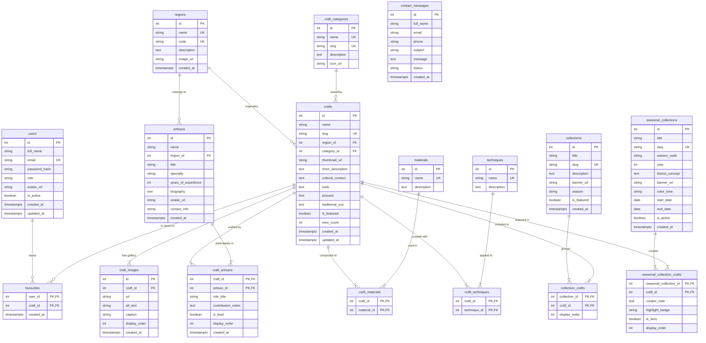

# CraftRoots – Thiết Kế Cơ Sở Dữ Liệu Chi Tiết (Database Architecture & Data Dictionary)

> **Tài liệu đặc tả chi tiết kiến trúc cơ sở dữ liệu PostgreSQL cho hệ thống CraftRoots.**  
> Kế thừa định hướng từ [docs/README.md](file:///e:/eproject1/docs/README.md) và tuân thủ các nguyên tắc chuẩn hoá kiến trúc dữ liệu tại [data design/data-design.md](file:///e:/eproject1/data%20design/data-design.md).  
> **Điểm cải tiến cốt lõi:** Chuyển đổi và chuẩn hóa mối quan hệ giữa **Nghệ nhân (Artisans)** và **Sản phẩm thủ công (Crafts)** từ quan hệ 1-N sang **mối quan hệ Nhiều - Nhiều (N-N)** thông qua bảng trung gian `craft_artisans`.

---

## Mục lục

1. [Tổng quan & Mục tiêu thiết kế](#1-tổng-quan--mục-tiêu-thiết-kế)
2. [Sơ đồ quan hệ thực thể (ERD Diagram)](#2-sơ-đồ-quan-hệ-thực-thể-erd-diagram)
3. [Quy chuẩn định danh & Kiểu dữ liệu PostgreSQL](#3-quy-chuẩn-định-danh--kiểu-dữ-liệu-postgresql)
4. [Từ điển dữ liệu chi tiết (Data Dictionary)](#4-từ-điển-dữ-liệu-chi-tiết-data-dictionary)
   - 4.1. [Bảng `users` (Người dùng & Xác thực)](#41-bảng-users-người-dùng--xác-thực)
   - 4.2. [Bảng `regions` (Vùng miền & Địa danh văn hóa)](#42-bảng-regions-vùng-miền--địa-danh-văn-hóa)
   - 4.3. [Bảng `craft_categories` (Loại hình nghề thủ công)](#43-bảng-craft_categories-loại-hình-nghề-thủ-công)
   - 4.4. [Bảng `materials` (Chất liệu chế tác)](#44-bảng-materials-chất-liệu-chế-tác)
   - 4.5. [Bảng `techniques` (Kỹ thuật chế tác)](#45-bảng-techniques-kỹ-thuật-chế-tác)
   - 4.6. [Bảng `artisans` (Hồ sơ nghệ nhân)](#46-bảng-artisans-hồ-sơ-nghệ-nhân)
   - 4.7. [Bảng `crafts` (Tác phẩm / Sản phẩm thủ công)](#47-bảng-crafts-tác-phẩm--sản-phẩm-thủ-công)
   - 4.8. [Bảng `craft_artisans` (Quan hệ N-N: Nghệ nhân ↔ Sản phẩm) ⭐](#48-bảng-craft_artisans-quan-hệ-n-n-nghệ-nhân--sản-phẩm-)
   - 4.9. [Bảng `craft_materials` (Quan hệ N-N: Sản phẩm ↔ Chất liệu)](#49-bảng-craft_materials-quan-hệ-n-n-sản-phẩm--chất-liệu)
   - 4.10. [Bảng `craft_techniques` (Quan hệ N-N: Sản phẩm ↔ Kỹ thuật)](#410-bảng-craft_techniques-quan-hệ-n-n-sản-phẩm--kỹ-thuật)
   - 4.11. [Bảng `craft_images` (Thư viện ảnh chi tiết sản phẩm)](#411-bảng-craft_images-thư-viện-ảnh-chi-tiết-sản-phẩm)
   - 4.12. [Bảng `collections` (Bộ sưu tập chuyên đề thông thường)](#412-bảng-collections-bộ-sưu-tập-chuyên-đề-thông-thường)
   - 4.13. [Bảng `collection_crafts` (Quan hệ N-N: Bộ sưu tập ↔ Sản phẩm)](#413-bảng-collection_crafts-quan-hệ-n-n-bộ-sưu-tập--sản-phẩm)
   - 4.14. [Bảng `seasonal_collections` (Bộ sưu tập theo mùa: Xuân, Hạ, Thu, Đông) ⭐](#414-bảng-seasonal_collections-bộ-sưu-tập-theo-mùa-xuân-hạ-thu-đông-)
   - 4.15. [Bảng `seasonal_collection_crafts` (Quan hệ N-N: Sản phẩm thuộc Bộ sưu tập mùa) ⭐](#415-bảng-seasonal_collection_crafts-quan-hệ-n-n-sản-phẩm-thuộc-bộ-sưu-tập-mùa-)
   - 4.16. [Bảng `favourites` (Danh sách yêu thích)](#416-bảng-favourites-danh-sách-yêu-thích)
   - 4.17. [Bảng `contact_messages` (Tin nhắn liên hệ)](#417-bảng-contact_messages-tin-nhắn-liên-hệ)
5. [Phân tích chuyên sâu các mô hình nghiệp vụ đặc thù](#5-phân-tích-chuyên-sâu-các-mô-hình-nghiệp-vụ-đặc-thù)
   - 5.1. [Mối quan hệ N-N Nghệ nhân – Sản phẩm (`craft_artisans`)](#51-bối-cảnh-thực-tiễn-và-lý-do-chuyển-đổi)
   - 5.2. [Mô hình Bộ sưu tập theo mùa (`seasonal_collections`) & Case Study Mùa Hè](#52-mô-hình-bộ-sưu-tập-theo-mùa-seasonal_collections--case-study-mùa-hè)
6. [Mã nguồn DDL PostgreSQL hoàn chỉnh (`schema.sql`)](#6-mã-nguồn-ddl-postgresql-hoàn-chỉnh-schemasql)
7. [Dữ liệu mẫu kiểm thử (`seed.sql` minh họa N-N & Bộ sưu tập mùa hè)](#7-dữ-liệu-mẫu-kiểm-thử-seedsql-minh-họa-quan-hệ-n-n)
8. [Chiến lược Đánh chỉ mục (Indexing Strategy) & Hiệu năng](#8-chiến-lược-đánh-chỉ-mục-indexing-strategy--hiệu-năng)
9. [Checklist Thẩm định & Kiểm soát chất lượng](#9-checklist-thẩm-định--kiểm-soát-chất-lượng)

---

## 1. Tổng quan & Mục tiêu thiết kế

Cơ sở dữ liệu CraftRoots phục vụ nền tảng số hóa di sản làng nghề thủ công truyền thống Việt Nam. Kiến trúc cơ sở dữ liệu được xây dựng nhằm đáp ứng các mục tiêu trọng tâm:

1. **Bảo tồn và phản ánh chính xác thực tế văn hóa làng nghề:**
   - Trong mỹ nghệ truyền thống (gốm sứ, sơn mài, đúc đồng...), một tác phẩm đỉnh cao thường là sự kết tinh tài hoa của **nhiều nghệ nhân** (nghệ nhân tạo dáng cốt, nghệ nhân vẽ men/thêu tay, nghệ nhân cẩn xà cừ/dát vàng).
   - Đồng thời, mỗi nghệ nhân trong suốt sự nghiệp sáng tạo ra **hàng trăm tác phẩm**.
   - Do đó, việc thiết kế quan hệ giữa `artisans` và `crafts` là **Nhiều - Nhiều (N-N)** là yêu cầu bắt buộc về cả mặt nghiệp vụ lẫn tính chân thực của văn hóa.
2. **Hỗ trợ tìm kiếm, lọc đa chiều mượt mà:**
   - Lọc sản phẩm kết hợp nhiều tiêu chí: Vùng miền (`regions`), Danh mục (`craft_categories`), Chất liệu (`materials`), Kỹ thuật (`techniques`), Nghệ nhân (`artisans`).
3. **Hiệu năng & Bảo mật:**
   - Khóa chính chuẩn hóa `SERIAL`/`BIGSERIAL`, khóa ngoại có chỉ số B-Tree tương ứng.
   - Hỗ trợ Full-Text Search (PostgreSQL `tsvector` + GIN Index) cho tên và ngữ cảnh văn hóa.
   - Mật khẩu người dùng được băm chuẩn bcrypt (`password_hash`), xác thực JWT không lưu session rác trên database.

---

## 2. Sơ đồ quan hệ thực thể (ERD Diagram)



---

## 3. Quy chuẩn định danh & Kiểu dữ liệu PostgreSQL

Tuân thủ nghiêm ngặt theo **Database Architecture Standard**:

* **Quy chuẩn tên bảng & cột:**
  - Tên bảng: Toàn bộ chữ thường dạng số nhiều (`users`, `crafts`, `artisans`), ngăn cách bằng `_` (`snake_case`).
  - Tên bảng liên kết Nhiều-Nhiều (Pivot / Junction Table): `<entity1>_<entity2>` (Ví dụ: `craft_artisans`, `craft_materials`, `collection_crafts`).
  - Khóa chính: Luôn là `id` trên các bảng thực thể độc lập.
  - Khóa ngoại: `<singular_entity>_id` (Ví dụ: `region_id`, `craft_id`, `artisan_id`).
  - Khóa chính bảng nối: Composite Primary Key `(craft_id, artisan_id)`.
* **Kiểu dữ liệu khuyến nghị cho PostgreSQL:**
  - Định danh khóa chính: `SERIAL` hoặc `INT GENERATED ALWAYS AS IDENTITY` (tương đương `INT4` 32-bit đủ cho ~2.1 tỷ bản ghi) hoặc `BIGSERIAL` cho bảng có lượng truy cập lớn.
  - Chuỗi văn bản: `VARCHAR(n)` có giới hạn hợp lý cho tên, mã; `TEXT` cho văn bản dài, bối cảnh văn hóa.
  - Cờ logic: `BOOLEAN NOT NULL DEFAULT FALSE`.
  - Mốc thời gian: `TIMESTAMPTZ` (Timestamp with time zone - lưu giờ chuẩn UTC).
* **Quy tắc xóa toàn vẹn (`ON DELETE`):**
  - Bảng trung gian n-n (`craft_artisans`, `craft_materials`, `favourites`): `ON DELETE CASCADE` (xóa sản phẩm hoặc nghệ nhân thì dòng liên kết trung gian tự hủy).
  - Khóa ngoại danh mục phân loại (`category_id`, `region_id`): `ON DELETE RESTRICT` (ngăn chặn vô tình xóa vùng miền hoặc danh mục nếu còn sản phẩm trực thuộc).

---

## 4. Từ điển dữ liệu chi tiết (Data Dictionary)

### 4.1. Bảng `users` (Người dùng & Xác thực)
Lưu trữ thông tin định danh và tài khoản người dùng đã đăng ký.

| Cột | Kiểu dữ liệu | Ràng buộc | Mặc định | Mô tả nghiệp vụ |
| :--- | :--- | :--- | :--- | :--- |
| `id` | `SERIAL` | **PK** | Tự tăng | Mã định danh người dùng |
| `full_name` | `VARCHAR(100)` | NOT NULL | | Họ và tên hiển thị |
| `email` | `VARCHAR(255)` | NOT NULL, **UNIQUE** | | Địa chỉ email dùng để đăng nhập |
| `password_hash` | `VARCHAR(255)` | NOT NULL | | Mật khẩu đã băm bằng thuật toán bcrypt |
| `role` | `VARCHAR(20)` | NOT NULL, CHECK | `'user'` | Phân quyền: `'user'`, `'admin'`, `'editor'` |
| `avatar_url` | `TEXT` | NULL | NULL | Đường dẫn ảnh đại diện người dùng |
| `is_active` | `BOOLEAN` | NOT NULL | `TRUE` | Trạng thái tài khoản (khoá/mở) |
| `created_at` | `TIMESTAMPTZ` | NOT NULL | `NOW()` | Thời điểm tạo tài khoản |
| `updated_at` | `TIMESTAMPTZ` | NOT NULL | `NOW()` | Thời điểm cập nhật hồ sơ gần nhất |

* **Chỉ mục (Indexes):**
  - `pk_users`: PRIMARY KEY (`id`)
  - `uk_users_email`: UNIQUE (`email`)
  - `idx_users_role`: INDEX (`role`)

---

### 4.2. Bảng `regions` (Vùng miền & Địa danh văn hóa)
Danh mục các vùng miền, tiểu vùng văn hóa hoặc tỉnh thành gắn liền với nghề truyền thống.

| Cột | Kiểu dữ liệu | Ràng buộc | Mặc định | Mô tả nghiệp vụ |
| :--- | :--- | :--- | :--- | :--- |
| `id` | `SERIAL` | **PK** | Tự tăng | Mã định danh vùng miền |
| `name` | `VARCHAR(100)` | NOT NULL, **UNIQUE** | | Tên vùng (Ví dụ: *Đồng bằng Bắc Bộ, Tây Nguyên*) |
| `code` | `VARCHAR(50)` | NOT NULL, **UNIQUE** | | Mã định danh/slug (Ví dụ: `bac-bo`, `tay-nguyen`) |
| `description` | `TEXT` | NULL | NULL | Giới thiệu đặc trưng văn hóa và lịch sử làng nghề |
| `image_url` | `TEXT` | NULL | NULL | Ảnh bản đồ tĩnh minh họa vùng miền |
| `created_at` | `TIMESTAMPTZ` | NOT NULL | `NOW()` | Ngày khởi tạo |

---

### 4.3. Bảng `craft_categories` (Loại hình nghề thủ công)
Phân loại các dòng sản phẩm thủ công (Gốm sứ, Dệt may thổ cẩm, Mây tre đan, Điêu khắc gỗ, Đúc đồng kim hoàn...).

| Cột | Kiểu dữ liệu | Ràng buộc | Mặc định | Mô tả nghiệp vụ |
| :--- | :--- | :--- | :--- | :--- |
| `id` | `SERIAL` | **PK** | Tự tăng | Mã danh mục nghề |
| `name` | `VARCHAR(100)` | NOT NULL, **UNIQUE** | | Tên phân loại (Ví dụ: *Gốm sứ, Thổ cẩm*) |
| `slug` | `VARCHAR(100)` | NOT NULL, **UNIQUE** | | Đường dẫn tĩnh thân thiện SEO |
| `description` | `TEXT` | NULL | NULL | Mô tả khái quát về loại hình |
| `icon_url` | `TEXT` | NULL | NULL | Biểu tượng icon hiển thị trên menu/bộ lọc |

---

### 4.4. Bảng `materials` (Chất liệu chế tác)
Tập danh mục nguyên vật liệu tự nhiên hoặc truyền thống (Đất sét Bát Tràng, Sợi gai, Tre gai, Đồng đỏ, Vỏ sò...).

| Cột | Kiểu dữ liệu | Ràng buộc | Mặc định | Mô tả nghiệp vụ |
| :--- | :--- | :--- | :--- | :--- |
| `id` | `SERIAL` | **PK** | Tự tăng | Mã chất liệu |
| `name` | `VARCHAR(100)` | NOT NULL, **UNIQUE** | | Tên chất liệu |
| `description` | `TEXT` | NULL | NULL | Đặc tính tự nhiên và nguồn gốc vật liệu |

---

### 4.5. Bảng `techniques` (Kỹ thuật chế tác)
Tập danh mục các phương pháp, kỹ thuật thủ công đặc thù (Vuốt tay bàn xoay, Nung củi men lam, Dệt dệt hoa văn cài chỉ, Cẩn xà cừ, Chạm đồng nổi...).

| Cột | Kiểu dữ liệu | Ràng buộc | Mặc định | Mô tả nghiệp vụ |
| :--- | :--- | :--- | :--- | :--- |
| `id` | `SERIAL` | **PK** | Tự tăng | Mã kỹ thuật chế tác |
| `name` | `VARCHAR(100)` | NOT NULL, **UNIQUE** | | Tên kỹ thuật |
| `description` | `TEXT` | NULL | NULL | Quy trình và độ khó của kỹ thuật |

---

### 4.6. Bảng `artisans` (Hồ sơ nghệ nhân)
Lưu trữ hồ sơ các bậc thầy, nghệ nhân dân gian nắm giữ bí quyết chế tác.

| Cột | Kiểu dữ liệu | Ràng buộc | Mặc định | Mô tả nghiệp vụ |
| :--- | :--- | :--- | :--- | :--- |
| `id` | `SERIAL` | **PK** | Tự tăng | Mã định danh nghệ nhân |
| `name` | `VARCHAR(100)` | NOT NULL | | Họ tên nghệ nhân |
| `region_id` | `INT` | **FK** trỏ `regions(id)` | NULL | Vùng quê hương / làng nghề gắn bó |
| `title` | `VARCHAR(100)` | NULL | NULL | Danh hiệu (Nghệ nhân Nhân dân, Nghệ nhân Ưu tú) |
| `specialty` | `VARCHAR(150)` | NULL | NULL | Lĩnh vực chuyên môn sở trường |
| `years_of_experience`| `INT` | CHECK (>= 0) | NULL | Số năm tuổi nghề |
| `biography` | `TEXT` | NULL | NULL | Tiểu sử cuộc đời và sự nghiệp cống hiến |
| `avatar_url` | `TEXT` | NULL | NULL | Ảnh chân dung nghệ nhân |
| `contact_info` | `VARCHAR(255)` | NULL | NULL | Thông tin liên hệ (xưởng sản xuất / địa chỉ) |
| `created_at` | `TIMESTAMPTZ` | NOT NULL | `NOW()` | Thời gian tạo hồ sơ |

* **Ràng buộc:** `fk_artisans_region`: FOREIGN KEY (`region_id`) REFERENCES `regions(id)` ON DELETE SET NULL.
* **Chỉ mục:** `idx_artisans_region`: INDEX (`region_id`).

---

### 4.7. Bảng `crafts` (Tác phẩm / Sản phẩm thủ công)
Thực thể trung tâm của cổng thông tin CraftRoots.  
*(Lưu ý: Trường `artisan_id` đơn lẻ trước đây đã được bãi bỏ để hỗ trợ quan hệ N-N thông qua bảng `craft_artisans`).*

| Cột | Kiểu dữ liệu | Ràng buộc | Mặc định | Mô tả nghiệp vụ |
| :--- | :--- | :--- | :--- | :--- |
| `id` | `SERIAL` | **PK** | Tự tăng | Mã sản phẩm |
| `name` | `VARCHAR(150)` | NOT NULL | | Tên tác phẩm / sản phẩm |
| `slug` | `VARCHAR(180)` | NOT NULL, **UNIQUE** | | Slug cho URL chi tiết |
| `region_id` | `INT` | **FK** trỏ `regions(id)` | | Vùng miền xuất xứ của tác phẩm |
| `category_id` | `INT` | **FK** trỏ `craft_categories(id)`| | Loại hình nghề thủ công |
| `thumbnail_url` | `TEXT` | NULL | NULL | Ảnh đại diện chính hiển thị trên card |
| `short_description`| `VARCHAR(500)`| NULL | NULL | Đoạn tóm tắt ngắn phục vụ SEO/preview |
| `cultural_context` | `TEXT` | NULL | NULL | Bối cảnh văn hóa, nguồn gốc lịch sử |
| `tools` | `TEXT` | NULL | NULL | Dụng cụ cần thiết để chế tác |
| `process` | `TEXT` | NULL | NULL | Các công đoạn chế tác công phu |
| `traditional_use` | `TEXT` | NULL | NULL | Ý nghĩa phong tục, công dụng trong đời sống |
| `is_featured` | `BOOLEAN` | NOT NULL | `FALSE` | Cờ ghim sản phẩm tiêu biểu lên trang chủ |
| `view_count` | `INT` | NOT NULL | `0` | Số lượt xem để sắp xếp phổ biến |
| `created_at` | `TIMESTAMPTZ` | NOT NULL | `NOW()` | Ngày tạo |
| `updated_at` | `TIMESTAMPTZ` | NOT NULL | `NOW()` | Ngày cập nhật |

* **Ràng buộc:**
  - `fk_crafts_region`: FOREIGN KEY (`region_id`) REFERENCES `regions(id)` ON DELETE RESTRICT
  - `fk_crafts_category`: FOREIGN KEY (`category_id`) REFERENCES `craft_categories(id)` ON DELETE RESTRICT
* **Chỉ mục:**
  - `idx_crafts_region`: INDEX (`region_id`)
  - `idx_crafts_category`: INDEX (`category_id`)
  - `idx_crafts_featured`: INDEX (`is_featured`) WHERE `is_featured = TRUE`
  - `idx_crafts_search_gin`: GIN INDEX trên `to_tsvector('simple', name || ' ' || COALESCE(cultural_context, ''))`

---

### 4.8. Bảng `craft_artisans` (Quan hệ N-N: Nghệ nhân ↔ Sản phẩm) ⭐
> **Bảng trọng tâm đáp ứng yêu cầu người dùng:** Biểu diễn mối quan hệ Nhiều - Nhiều giữa Nghệ nhân và Sản phẩm:  
> - **1 Nghệ nhân sáng tạo / chế tác nhiều Sản phẩm**  
> - **1 Sản phẩm được tạo tác / hợp tác bởi nhiều Nghệ nhân** (ví dụ: Nghệ nhân chính, Nghệ nhân phối men, Nghệ nhân điêu khắc hoa văn)

| Cột | Kiểu dữ liệu | Ràng buộc | Mặc định | Mô tả nghiệp vụ |
| :--- | :--- | :--- | :--- | :--- |
| `craft_id` | `INT` | **PK**, **FK** trỏ `crafts(id)` | | Mã sản phẩm thủ công |
| `artisan_id` | `INT` | **PK**, **FK** trỏ `artisans(id)` | | Mã nghệ nhân tham gia chế tác |
| `role_title` | `VARCHAR(100)` | NULL | `'Chủ trì chế tác'` | Vai trò cụ thể: *Nghệ nhân tạo dáng, Nghệ nhân phối men, Chạm hoa văn, Nghệ nhân truyền nghề* |
| `contribution_notes`| `TEXT` | NULL | NULL | Ghi chú đóng góp chi tiết của nghệ nhân vào tác phẩm |
| `is_lead` | `BOOLEAN` | NOT NULL | `FALSE` | Đánh dấu nghệ nhân chính/đại diện để hiển thị ưu tiên |
| `display_order` | `INT` | NOT NULL | `1` | Thứ tự hiển thị trong danh sách người tạo tác |
| `created_at` | `TIMESTAMPTZ` | NOT NULL | `NOW()` | Thời điểm gán liên kết |

* **Khóa chính hợp thành (Composite PK):** `PRIMARY KEY (craft_id, artisan_id)`
* **Ràng buộc khóa ngoại:**
  - `fk_craft_artisans_craft`: FOREIGN KEY (`craft_id`) REFERENCES `crafts(id)` **ON DELETE CASCADE**
  - `fk_craft_artisans_artisan`: FOREIGN KEY (`artisan_id`) REFERENCES `artisans(id)` **ON DELETE CASCADE**
* **Chỉ mục:**
  - `idx_craft_artisans_artisan_id`: INDEX (`artisan_id`) — Tối ưu cực đại khi truy vấn: *"Tìm tất cả tác phẩm do Nghệ nhân X làm ra"*.

---

### 4.9. Bảng `craft_materials` (Quan hệ N-N: Sản phẩm ↔ Chất liệu)
Biểu diễn việc 1 sản phẩm có thể kết hợp nhiều chất liệu (gỗ, đồng, xà cừ), và 1 chất liệu được dùng trong nhiều sản phẩm.

| Cột | Kiểu dữ liệu | Ràng buộc | Mặc định | Mô tả nghiệp vụ |
| :--- | :--- | :--- | :--- | :--- |
| `craft_id` | `INT` | **PK**, **FK** trỏ `crafts(id)` | | Mã sản phẩm |
| `material_id` | `INT` | **PK**, **FK** trỏ `materials(id)`| | Mã chất liệu |

* **Khóa chính:** `PRIMARY KEY (craft_id, material_id)`
* **Ràng buộc khóa ngoại:**
  - `fk_craft_materials_craft`: FOREIGN KEY (`craft_id`) REFERENCES `crafts(id)` ON DELETE CASCADE
  - `fk_craft_materials_mat`: FOREIGN KEY (`material_id`) REFERENCES `materials(id)` ON DELETE CASCADE
* **Chỉ mục:** `idx_craft_materials_material_id`: INDEX (`material_id`)

---

### 4.10. Bảng `craft_techniques` (Quan hệ N-N: Sản phẩm ↔ Kỹ thuật)
Biểu diễn việc 1 sản phẩm trải qua nhiều kỹ thuật gia công, và 1 kỹ thuật được ứng dụng cho nhiều sản phẩm.

| Cột | Kiểu dữ liệu | Ràng buộc | Mặc định | Mô tả nghiệp vụ |
| :--- | :--- | :--- | :--- | :--- |
| `craft_id` | `INT` | **PK**, **FK** trỏ `crafts(id)` | | Mã sản phẩm |
| `technique_id`| `INT` | **PK**, **FK** trỏ `techniques(id)`| | Mã kỹ thuật |

* **Khóa chính:** `PRIMARY KEY (craft_id, technique_id)`
* **Ràng buộc khóa ngoại:**
  - `fk_craft_techniques_craft`: FOREIGN KEY (`craft_id`) REFERENCES `crafts(id)` ON DELETE CASCADE
  - `fk_craft_techniques_tech`: FOREIGN KEY (`technique_id`) REFERENCES `techniques(id)` ON DELETE CASCADE
* **Chỉ mục:** `idx_craft_techniques_technique_id`: INDEX (`technique_id`)

---

### 4.11. Bảng `craft_images` (Thư viện ảnh chi tiết sản phẩm)
Hỗ trợ chức năng Gallery và Lightbox phóng to ảnh, góc nhìn cận cảnh độ tinh xảo của sản phẩm.

| Cột | Kiểu dữ liệu | Ràng buộc | Mặc định | Mô tả nghiệp vụ |
| :--- | :--- | :--- | :--- | :--- |
| `id` | `SERIAL` | **PK** | Tự tăng | Mã ảnh |
| `craft_id` | `INT` | **FK** trỏ `crafts(id)` | | Mã sản phẩm chứa ảnh |
| `url` | `TEXT` | NOT NULL | | Đường dẫn URL hình ảnh độ phân giải cao |
| `alt_text` | `VARCHAR(255)` | NOT NULL | | Văn bản thay thế hỗ trợ SEO & Accessibility |
| `caption` | `VARCHAR(255)` | NULL | NULL | Chú thích chi tiết dưới ảnh |
| `display_order`| `INT` | NOT NULL | `0` | Thứ tự trình chiếu trong Lightbox |
| `created_at` | `TIMESTAMPTZ` | NOT NULL | `NOW()` | Thời điểm tải lên |

* **Ràng buộc:** `fk_craft_images_craft`: FOREIGN KEY (`craft_id`) REFERENCES `crafts(id)` ON DELETE CASCADE
* **Chỉ mục:** `idx_craft_images_craft_order`: INDEX (`craft_id`, `display_order`)

---

### 4.12. Bảng `collections` (Bộ sưu tập chuyên đề thông thường)
Quản lý các bộ sưu tập tuyển chọn thông thường (Ví dụ: *Sắc gốm nghìn năm, Nghệ thuật Dệt Thổ Cẩm Tây Bắc, Độc bản Làng nghề*).

| Cột | Kiểu dữ liệu | Ràng buộc | Mặc định | Mô tả nghiệp vụ |
| :--- | :--- | :--- | :--- | :--- |
| `id` | `SERIAL` | **PK** | Tự tăng | Mã bộ sưu tập |
| `title` | `VARCHAR(150)` | NOT NULL | | Tên chủ đề bộ sưu tập |
| `slug` | `VARCHAR(180)` | NOT NULL, **UNIQUE** | | Đường dẫn tĩnh |
| `description` | `TEXT` | NULL | NULL | Bài viết dẫn dắt giới thiệu bộ sưu tập |
| `banner_url` | `TEXT` | NULL | NULL | Ảnh bìa banner lớn |
| `is_featured` | `BOOLEAN` | NOT NULL | `FALSE` | Hiển thị nổi bật tại trang chủ |
| `created_at` | `TIMESTAMPTZ` | NOT NULL | `NOW()` | Thời điểm tạo |

---

### 4.13. Bảng `collection_crafts` (Quan hệ N-N: Bộ sưu tập ↔ Sản phẩm)
Một bộ sưu tập gom nhiều sản phẩm; một sản phẩm có thể thuộc nhiều bộ sưu tập khác nhau.

| Cột | Kiểu dữ liệu | Ràng buộc | Mặc định | Mô tả nghiệp vụ |
| :--- | :--- | :--- | :--- | :--- |
| `collection_id`| `INT` | **PK**, **FK** trỏ `collections(id)`| | Mã bộ sưu tập |
| `craft_id` | `INT` | **PK**, **FK** trỏ `crafts(id)` | | Mã sản phẩm |
| `display_order`| `INT` | NOT NULL | `0` | Vị trí sắp xếp trong bộ sưu tập |

* **Khóa chính:** `PRIMARY KEY (collection_id, craft_id)`
* **Ràng buộc:**
  - `fk_coll_crafts_coll`: FOREIGN KEY (`collection_id`) REFERENCES `collections(id)` ON DELETE CASCADE
  - `fk_coll_crafts_craft`: FOREIGN KEY (`craft_id`) REFERENCES `crafts(id)` ON DELETE CASCADE

---

### 4.14. Bảng `seasonal_collections` (Bộ sưu tập theo mùa: Xuân, Hạ, Thu, Đông) ⭐
Quản lý các chiến dịch bộ sưu tập gắn chặt với 4 mùa trong năm và các dịp thời tiết/lễ hội đặc thù (Ví dụ: *Bộ sưu tập Mùa Hè: Gió Biển & Mây Tre Đan*, *Sắc Lam Mát Lạnh Ngày Hè*, *Bộ sưu tập Thu Quyến Rũ*). Bảng này hỗ trợ chu kỳ thời gian kích hoạt tự động theo mùa (`start_date`, `end_date`), tông màu giao diện chủ đạo (`color_tone`), và định danh mùa cụ thể (`season_code`).

| Cột | Kiểu dữ liệu | Ràng buộc | Mặc định | Mô tả nghiệp vụ |
| :--- | :--- | :--- | :--- | :--- |
| `id` | `SERIAL` | **PK** | Tự tăng | Mã định danh bộ sưu tập mùa |
| `title` | `VARCHAR(150)` | NOT NULL | | Tên bộ sưu tập (Ví dụ: *Sắc Lam Mát Lành – Bộ Sưu Tập Mùa Hè 2026*) |
| `slug` | `VARCHAR(180)` | NOT NULL, **UNIQUE** | | Đường dẫn tĩnh thân thiện SEO (`mua-he-2026-mat-lanh`) |
| `season_code` | `VARCHAR(20)` | NOT NULL, CHECK | | Phân loại mùa: `'summer'` (Mùa Hè), `'spring'` (Mùa Xuân), `'autumn'` (Mùa Thu), `'winter'` (Mùa Đông) |
| `year` | `INT` | NOT NULL, CHECK (> 2000) | | Năm áp dụng (Ví dụ: 2026) |
| `theme_concept` | `TEXT` | NULL | NULL | Triết lý/chủ đề mùa (Ví dụ: *Ứng dụng chất liệu tre nứa, chiếu cói, lụa tơ tằm và gốm men mát giúp điều hòa không khí ngày hè oi bức*) |
| `banner_url` | `TEXT` | NULL | NULL | Ảnh bìa banner chủ đề mùa hè rộng lớn |
| `color_tone` | `VARCHAR(30)` | NULL | `'#0ea5e9'` | Mã màu sắc chủ đạo đại diện cho mùa (phục vụ giao diện động UI) |
| `start_date` | `DATE` | NOT NULL | | Ngày mở chiến dịch mùa (Ví dụ: `2026-05-01` bắt đầu hè) |
| `end_date` | `DATE` | NOT NULL, CHECK | | Ngày kết thúc chiến dịch mùa (Ví dụ: `2026-08-31`) |
| `is_active` | `BOOLEAN` | NOT NULL | `TRUE` | Bật/tắt trạng thái hiển thị bộ sưu tập mùa trên trang chủ |
| `created_at` | `TIMESTAMPTZ` | NOT NULL | `NOW()` | Thời điểm khởi tạo |

* **Chỉ mục:**
  - `pk_seasonal_collections`: PRIMARY KEY (`id`)
  - `uk_seasonal_collections_slug`: UNIQUE (`slug`)
  - `idx_seasonal_collections_active`: INDEX (`is_active`, `season_code`, `year`)
  - `idx_seasonal_collections_dates`: INDEX (`start_date`, `end_date`)

---

### 4.15. Bảng `seasonal_collection_crafts` (Quan hệ N-N: Sản phẩm thuộc Bộ sưu tập mùa) ⭐
> **Bảng trọng tâm theo yêu cầu:** Biểu diễn danh sách các sản phẩm thủ công được tuyển chọn chuyên biệt cho từng bộ sưu tập mùa (Ví dụ: *Bộ mùa hè thì có các sản phẩm quạt nan Chàng Sơn, chiếu cói Nga Sơn, bình gốm men ngọc Bát Tràng, lụa mỏng Vạn Phúc...*).

| Cột | Kiểu dữ liệu | Ràng buộc | Mặc định | Mô tả nghiệp vụ |
| :--- | :--- | :--- | :--- | :--- |
| `seasonal_collection_id` | `INT` | **PK**, **FK** trỏ `seasonal_collections(id)` | | Mã bộ sưu tập mùa (Ví dụ: Bộ sưu tập Mùa Hè) |
| `craft_id` | `INT` | **PK**, **FK** trỏ `crafts(id)` | | Mã sản phẩm thủ công |
| `curator_note` | `TEXT` | NULL | NULL | Lời bình giám tuyển giải thích vì sao sản phẩm phù hợp cho mùa hè (Ví dụ: *"Chất liệu cói dệt tay tự nhiên có đặc tính tản nhiệt cao, mang lại giấc ngủ thanh mát không bí bách trong những đêm hè nóng ẩm"*) |
| `highlight_badge` | `VARCHAR(50)` | NULL | NULL | Nhãn ấn tượng theo mùa: *'Giải nhiệt mùa hạ'*, *'Tươi mát tự nhiên'*, *'Tiêu điểm mùa hè'* |
| `is_hero` | `BOOLEAN` | NOT NULL | `FALSE` | Đánh dấu tác phẩm tâm điểm (Hero Item) hiển thị đầu danh mục mùa |
| `display_order` | `INT` | NOT NULL | `1` | Thứ tự trình bày trên giao diện lưới sản phẩm theo mùa |
| `created_at` | `TIMESTAMPTZ` | NOT NULL | `NOW()` | Thời điểm thêm sản phẩm vào bộ mùa |

* **Khóa chính hợp thành:** `PRIMARY KEY (seasonal_collection_id, craft_id)`
* **Ràng buộc khóa ngoại:**
  - `fk_sc_crafts_collection`: FOREIGN KEY (`seasonal_collection_id`) REFERENCES `seasonal_collections(id)` **ON DELETE CASCADE**
  - `fk_sc_crafts_craft`: FOREIGN KEY (`craft_id`) REFERENCES `crafts(id)` **ON DELETE CASCADE**
* **Chỉ mục:**
  - `idx_sc_crafts_craft_id`: INDEX (`craft_id`)
  - `idx_sc_crafts_hero`: INDEX (`seasonal_collection_id`, `is_hero`)

---

### 4.16. Bảng `favourites` (Danh sách yêu thích)
Lưu trữ danh sách sản phẩm yêu thích của từng người dùng đã đăng nhập (hỗ trợ đồng bộ đa thiết bị từ LocalStorage).

| Cột | Kiểu dữ liệu | Ràng buộc | Mặc định | Mô tả nghiệp vụ |
| :--- | :--- | :--- | :--- | :--- |
| `user_id` | `INT` | **PK**, **FK** trỏ `users(id)` | | Mã người dùng |
| `craft_id` | `INT` | **PK**, **FK** trỏ `crafts(id)` | | Mã sản phẩm yêu thích |
| `created_at` | `TIMESTAMPTZ` | NOT NULL | `NOW()` | Thời điểm nhấn yêu thích |

* **Khóa chính:** `PRIMARY KEY (user_id, craft_id)`
* **Ràng buộc:**
  - `fk_fav_user`: FOREIGN KEY (`user_id`) REFERENCES `users(id)` ON DELETE CASCADE
  - `fk_fav_craft`: FOREIGN KEY (`craft_id`) REFERENCES `crafts(id)` ON DELETE CASCADE

---

### 4.17. Bảng `contact_messages` (Tin nhắn liên hệ)
Tiếp nhận tin nhắn, thắc mắc hoặc đề xuất hợp tác từ biểu mẫu liên hệ của khách truy cập.

| Cột | Kiểu dữ liệu | Ràng buộc | Mặc định | Mô tả nghiệp vụ |
| :--- | :--- | :--- | :--- | :--- |
| `id` | `SERIAL` | **PK** | Tự tăng | Mã tin nhắn |
| `full_name` | `VARCHAR(100)` | NOT NULL | | Họ tên người gửi |
| `email` | `VARCHAR(255)` | NOT NULL | | Email liên hệ |
| `phone` | `VARCHAR(30)` | NULL | NULL | Số điện thoại (tùy chọn) |
| `subject` | `VARCHAR(200)` | NULL | NULL | Tiêu đề thư |
| `message` | `TEXT` | NOT NULL | | Nội dung lời nhắn |
| `status` | `VARCHAR(30)` | NOT NULL | `'unread'` | Trạng thái: `'unread'`, `'read'`, `'replied'` |
| `created_at` | `TIMESTAMPTZ` | NOT NULL | `NOW()` | Thời điểm gửi |

---

## 5. Phân tích chuyên sâu các mô hình nghiệp vụ đặc thù

### 5.1. Mối quan hệ N-N Nghệ nhân – Sản phẩm (`craft_artisans`)

#### 5.1.1. Bối cảnh thực tiễn và Lý do chuyển đổi
Trong thiết kế ban đầu tại `README.md`, bảng `crafts` có một trường khóa ngoại trực tiếp:
```sql
-- Thiết kế cũ (Hạn chế):
CREATE TABLE crafts (
  ...
  artisan_id INT REFERENCES artisans(id), -- Chỉ cho phép 1 nghệ nhân duy nhất cho 1 sản phẩm!
  ...
);
```

**Nhược điểm nghiêm trọng của thiết kế cũ:**
1. **Vi phạm thực tế chế tác thủ công:** 
   - Một chiếc *Bình gốm men lam độc bản dát vàng* cần:
     - Nghệ nhân A (Chuyên gia vuốt gốm tạo cốt dáng).
     - Nghệ nhân B (Bậc thầy vẽ hoa văn men lam cổ).
     - Nghệ nhân C (Nghệ nhân kim hoàn dát vàng quỳ).
   - Thiết kế 1-N buộc người biên tập phải bỏ sót các nghệ nhân đồng sáng tạo, gây thiếu sót thông tin văn hóa.
2. **Không ghi nhận được vai trò chuyên biệt:**
   - Khi đưa vào bảng trung gian `craft_artisans`, ta bổ sung được trường `role_title` và `contribution_notes` nhằm làm nổi bật chính xác nghệ nhân nào đóng vai trò gì.
3. **Tính linh hoạt:**
   - Cho phép tác phẩm tập thể của một hợp tác xã làng nghề hoặc dự án hợp tác liên làng nghề được ghi nhận đầy đủ.

#### 5.1.2. Các câu truy vấn mẫu (SQL Patterns) với bảng `craft_artisans`

##### Truy vấn 1: Lấy chi tiết sản phẩm kèm danh sách TẤT CẢ nghệ nhân tham gia và vai trò của họ
```sql
SELECT 
    c.id AS craft_id,
    c.name AS craft_name,
    c.thumbnail_url,
    r.name AS region_name,
    cat.name AS category_name,
    json_agg(
        json_build_object(
            'artisan_id', a.id,
            'artisan_name', a.name,
            'title', a.title,
            'role_title', ca.role_title,
            'contribution_notes', ca.contribution_notes,
            'is_lead', ca.is_lead,
            'avatar_url', a.avatar_url
        ) ORDER BY ca.is_lead DESC, ca.display_order ASC
    ) AS artisans_list
FROM crafts c
JOIN regions r ON c.region_id = r.id
JOIN craft_categories cat ON c.category_id = cat.id
LEFT JOIN craft_artisans ca ON c.id = ca.craft_id
LEFT JOIN artisans a ON ca.artisan_id = a.id
WHERE c.id = 1
GROUP BY c.id, c.name, c.thumbnail_url, r.name, cat.name;
```

##### Truy vấn 2: Xem hồ sơ nghệ nhân kèm danh sách tất cả các sản phẩm nghệ nhân đó tham gia chế tác
```sql
SELECT 
    a.id AS artisan_id,
    a.name AS artisan_name,
    a.specialty,
    c.id AS craft_id,
    c.name AS craft_name,
    c.thumbnail_url,
    ca.role_title,
    ca.is_lead
FROM artisans a
JOIN craft_artisans ca ON a.id = ca.artisan_id
JOIN crafts c ON ca.craft_id = c.id
WHERE a.id = 2
ORDER BY c.created_at DESC;
```

---

### 5.2. Mô hình Bộ sưu tập theo mùa (`seasonal_collections`) & Case Study Mùa Hè

#### 5.2.1. Nghiệp vụ thực tế: Tại sao cần bảng chuyên biệt cho Bộ sưu tập mùa?
Các sản phẩm thủ công mỹ nghệ Việt Nam gắn liền mật thiết với thời tiết khí hậu bốn mùa và lối sống truyền thống:
* **Bộ sưu tập Mùa Hè (Summer Collection):** Khí hậu hè oi ả, người dùng và khách du lịch tìm kiếm các tác phẩm mang lại sự mát mẻ, thanh nhiệt và nhẹ nhàng:
  - **Quạt nan, quạt giấy Chàng Sơn:** Nhẹ, nan tre dẻo dai, tạo gió mát tự nhiên xua tan oi ả.
  - **Chiếu cói Nga Sơn / Chiếu dệt Cà Mau:** Sợi cói tự nhiên hút ẩm, nằm mát lưng, không gây bí bách.
  - **Bộ ấm chén gốm men ngọc Bát Tràng:** Màu xanh ngọc thanh thoát mang lại cảm giác dịu mắt giữa ngày hè nắng gắt.
  - **Khăn lụa tơ tằm mỏng Vạn Phúc / Đũi Nam Cao:** Thấm hút mồ hôi, thoáng khí.
  - **Nón lá sen xứ Huế:** Che nắng ngày hè với hương sen thơm dịu nhẹ.
* **Bộ sưu tập Mùa Đông / Mùa Thu / Tết Nguyên Đán:** Tập trung vào các sản phẩm ấm cúng (gốm đất nung, tranh Tết Đông Hồ, đỉnh đồng thờ tự).

#### 5.2.2. Ưu điểm kiến trúc của bảng nối `seasonal_collection_crafts`
1. **Quan hệ N-N linh hoạt:** 
   - **1 Bộ mùa hè có nhiều sản phẩm:** Tập hợp từ 5 đến 20 sản phẩm thuộc các ngành nghề khác nhau (dệt, gốm, tre đan) cùng phục vụ chủ đề mùa hè.
   - **1 Sản phẩm có thể thuộc nhiều bộ mùa:** Ví dụ, *Bình gốm men ngọc* có thể góp mặt trong *Bộ Sưu Tập Mùa Hè 2025* và tiếp tục được vinh danh trong *Bộ Sưu Tập Mùa Hè 2026*.
2. **Giá trị gia tăng từ Lời bình giám tuyển (`curator_note`):**
   - Mỗi sản phẩm khi đưa vào bộ mùa hè đều có lý do văn hóa riêng (ví dụ: giải thích tại sao chiếu cói lại làm mát cơ thể, hoặc vì sao men ngọc lại làm dịu tâm trí trong mùa hè).
3. **Quản lý vòng đời chiến dịch (`start_date`, `end_date`, `is_active`):**
   - Tự động hiển thị Bộ sưu tập Mùa Hè khi đến ngày 01/05 và tự động chuyển sang Bộ sưu tập Mùa Thu sau ngày 31/08 mà không cần sửa code.

#### 5.2.3. Truy vấn mẫu: Lấy thông tin Bộ sưu tập Mùa Hè đang diễn ra kèm danh sách sản phẩm
```sql
SELECT 
    sc.id AS collection_id,
    sc.title AS collection_title,
    sc.theme_concept,
    sc.banner_url,
    sc.color_tone,
    json_agg(
        json_build_object(
            'craft_id', c.id,
            'craft_name', c.name,
            'thumbnail_url', c.thumbnail_url,
            'category_name', cat.name,
            'curator_note', scc.curator_note,
            'highlight_badge', scc.highlight_badge,
            'is_hero', scc.is_hero,
            'display_order', scc.display_order
        ) ORDER BY scc.is_hero DESC, scc.display_order ASC
    ) AS summer_crafts
FROM seasonal_collections sc
JOIN seasonal_collection_crafts scc ON sc.id = scc.seasonal_collection_id
JOIN crafts c ON scc.craft_id = c.id
JOIN craft_categories cat ON c.category_id = cat.id
WHERE sc.season_code = 'summer'
  AND sc.is_active = TRUE
  AND CURRENT_DATE BETWEEN sc.start_date AND sc.end_date
GROUP BY sc.id, sc.title, sc.theme_concept, sc.banner_url, sc.color_tone;
```

---

## 6. Mã nguồn DDL PostgreSQL hoàn chỉnh (`schema.sql`)

Dưới đây là mã nguồn DDL SQL hoàn chỉnh, sẵn sàng nạp trực tiếp vào PostgreSQL (`psql -U postgres -d craftroots -f server/db/schema.sql`):

```sql
-- =============================================================================
-- CRAFTROOTS DATABASE SCHEMA (PostgreSQL 14+)
-- Hệ thống Cổng Thông Tin Khám Phá Nghề Thủ Công Truyền Thống
-- Hỗ trợ quan hệ N-N Nghệ nhân - Sản phẩm (craft_artisans)
-- =============================================================================

-- Xóa bảng cũ theo thứ tự phụ thuộc (nếu cần tái thiết lập)
DROP TABLE IF EXISTS contact_messages CASCADE;
DROP TABLE IF EXISTS favourites CASCADE;
DROP TABLE IF EXISTS seasonal_collection_crafts CASCADE;
DROP TABLE IF EXISTS seasonal_collections CASCADE;
DROP TABLE IF EXISTS collection_crafts CASCADE;
DROP TABLE IF EXISTS collections CASCADE;
DROP TABLE IF EXISTS craft_images CASCADE;
DROP TABLE IF EXISTS craft_techniques CASCADE;
DROP TABLE IF EXISTS craft_materials CASCADE;
DROP TABLE IF EXISTS craft_artisans CASCADE;
DROP TABLE IF EXISTS crafts CASCADE;
DROP TABLE IF EXISTS artisans CASCADE;
DROP TABLE IF EXISTS techniques CASCADE;
DROP TABLE IF EXISTS materials CASCADE;
DROP TABLE IF EXISTS craft_categories CASCADE;
DROP TABLE IF EXISTS regions CASCADE;
DROP TABLE IF EXISTS users CASCADE;

-- 1. Bảng USERS
CREATE TABLE users (
    id            SERIAL PRIMARY KEY,
    full_name     VARCHAR(100) NOT NULL,
    email         VARCHAR(255) NOT NULL UNIQUE,
    password_hash VARCHAR(255) NOT NULL,
    role          VARCHAR(20)  NOT NULL DEFAULT 'user' CHECK (role IN ('user', 'admin', 'editor')),
    avatar_url    TEXT,
    is_active     BOOLEAN      NOT NULL DEFAULT TRUE,
    created_at    TIMESTAMPTZ  NOT NULL DEFAULT NOW(),
    updated_at    TIMESTAMPTZ  NOT NULL DEFAULT NOW()
);

-- 2. Bảng REGIONS (Vùng miền)
CREATE TABLE regions (
    id          SERIAL PRIMARY KEY,
    name        VARCHAR(100) NOT NULL UNIQUE,
    code        VARCHAR(50)  NOT NULL UNIQUE,
    description TEXT,
    image_url   TEXT,
    created_at  TIMESTAMPTZ  NOT NULL DEFAULT NOW()
);

-- 3. Bảng CRAFT_CATEGORIES (Loại hình nghề)
CREATE TABLE craft_categories (
    id          SERIAL PRIMARY KEY,
    name        VARCHAR(100) NOT NULL UNIQUE,
    slug        VARCHAR(100) NOT NULL UNIQUE,
    description TEXT,
    icon_url    TEXT
);

-- 4. Bảng MATERIALS (Chất liệu)
CREATE TABLE materials (
    id          SERIAL PRIMARY KEY,
    name        VARCHAR(100) NOT NULL UNIQUE,
    description TEXT
);

-- 5. Bảng TECHNIQUES (Kỹ thuật chế tác)
CREATE TABLE techniques (
    id          SERIAL PRIMARY KEY,
    name        VARCHAR(100) NOT NULL UNIQUE,
    description TEXT
);

-- 6. Bảng ARTISANS (Nghệ nhân)
CREATE TABLE artisans (
    id                  SERIAL PRIMARY KEY,
    name                VARCHAR(100) NOT NULL,
    region_id           INT REFERENCES regions(id) ON DELETE SET NULL,
    title               VARCHAR(100), -- Nghệ nhân Nhân dân / Nghệ nhân Ưu tú
    specialty           VARCHAR(150),
    years_of_experience INT CHECK (years_of_experience >= 0),
    biography           TEXT,
    avatar_url          TEXT,
    contact_info        VARCHAR(255),
    created_at          TIMESTAMPTZ  NOT NULL DEFAULT NOW()
);

-- 7. Bảng CRAFTS (Sản phẩm thủ công - đã chuyển artisan_id sang bảng n-n)
CREATE TABLE crafts (
    id                SERIAL PRIMARY KEY,
    name              VARCHAR(150) NOT NULL,
    slug              VARCHAR(180) NOT NULL UNIQUE,
    region_id         INT NOT NULL REFERENCES regions(id) ON DELETE RESTRICT,
    category_id       INT NOT NULL REFERENCES craft_categories(id) ON DELETE RESTRICT,
    thumbnail_url     TEXT,
    short_description VARCHAR(500),
    cultural_context  TEXT,
    tools             TEXT,
    process           TEXT,
    traditional_use   TEXT,
    is_featured       BOOLEAN     NOT NULL DEFAULT FALSE,
    view_count        INT         NOT NULL DEFAULT 0,
    created_at        TIMESTAMPTZ NOT NULL DEFAULT NOW(),
    updated_at        TIMESTAMPTZ NOT NULL DEFAULT NOW()
);

-- 8. Bảng CRAFT_ARTISANS (Quan hệ Nhiều - Nhiều giữa Crafts và Artisans) ⭐
CREATE TABLE craft_artisans (
    craft_id           INT NOT NULL REFERENCES crafts(id) ON DELETE CASCADE,
    artisan_id         INT NOT NULL REFERENCES artisans(id) ON DELETE CASCADE,
    role_title         VARCHAR(100) DEFAULT 'Chủ trì chế tác',
    contribution_notes TEXT,
    is_lead            BOOLEAN NOT NULL DEFAULT FALSE,
    display_order      INT NOT NULL DEFAULT 1,
    created_at         TIMESTAMPTZ NOT NULL DEFAULT NOW(),
    PRIMARY KEY (craft_id, artisan_id)
);

-- 9. Bảng CRAFT_MATERIALS (Quan hệ n-n: Sản phẩm ↔ Chất liệu)
CREATE TABLE craft_materials (
    craft_id    INT NOT NULL REFERENCES crafts(id) ON DELETE CASCADE,
    material_id INT NOT NULL REFERENCES materials(id) ON DELETE CASCADE,
    PRIMARY KEY (craft_id, material_id)
);

-- 10. Bảng CRAFT_TECHNIQUES (Quan hệ n-n: Sản phẩm ↔ Kỹ thuật)
CREATE TABLE craft_techniques (
    craft_id     INT NOT NULL REFERENCES crafts(id) ON DELETE CASCADE,
    technique_id INT NOT NULL REFERENCES techniques(id) ON DELETE CASCADE,
    PRIMARY KEY (craft_id, technique_id)
);

-- 11. Bảng CRAFT_IMAGES (Thư viện ảnh tương tác Lightbox)
CREATE TABLE craft_images (
    id            SERIAL PRIMARY KEY,
    craft_id      INT NOT NULL REFERENCES crafts(id) ON DELETE CASCADE,
    url           TEXT NOT NULL,
    alt_text      VARCHAR(255) NOT NULL,
    caption       VARCHAR(255),
    display_order INT NOT NULL DEFAULT 0,
    created_at    TIMESTAMPTZ NOT NULL DEFAULT NOW()
);

-- 12. Bảng COLLECTIONS (Bộ sưu tập theo mùa / tuyển chọn)
CREATE TABLE collections (
    id          SERIAL PRIMARY KEY,
    title       VARCHAR(150) NOT NULL,
    slug        VARCHAR(180) NOT NULL UNIQUE,
    description TEXT,
    banner_url  TEXT,
    season      VARCHAR(50),
    is_featured BOOLEAN NOT NULL DEFAULT FALSE,
    created_at  TIMESTAMPTZ NOT NULL DEFAULT NOW()
);

-- 13. Bảng COLLECTION_CRAFTS (Quan hệ n-n: Bộ sưu tập ↔ Sản phẩm)
CREATE TABLE collection_crafts (
    collection_id INT NOT NULL REFERENCES collections(id) ON DELETE CASCADE,
    craft_id      INT NOT NULL REFERENCES crafts(id) ON DELETE CASCADE,
    display_order INT NOT NULL DEFAULT 0,
    PRIMARY KEY (collection_id, craft_id)
);

-- 14. Bảng SEASONAL_COLLECTIONS (Bộ sưu tập theo mùa: Xuân, Hạ, Thu, Đông) ⭐
CREATE TABLE seasonal_collections (
    id            SERIAL PRIMARY KEY,
    title         VARCHAR(150) NOT NULL,
    slug          VARCHAR(180) NOT NULL UNIQUE,
    season_code   VARCHAR(20)  NOT NULL CHECK (season_code IN ('summer', 'spring', 'autumn', 'winter')),
    year          INT          NOT NULL CHECK (year >= 2000),
    theme_concept TEXT,
    banner_url    TEXT,
    color_tone    VARCHAR(30)  DEFAULT '#0ea5e9',
    start_date    DATE         NOT NULL,
    end_date      DATE         NOT NULL CHECK (end_date >= start_date),
    is_active     BOOLEAN      NOT NULL DEFAULT TRUE,
    created_at    TIMESTAMPTZ  NOT NULL DEFAULT NOW()
);

-- 15. Bảng SEASONAL_COLLECTION_CRAFTS (Quan hệ N-N: Sản phẩm thuộc Bộ sưu tập mùa) ⭐
CREATE TABLE seasonal_collection_crafts (
    seasonal_collection_id INT NOT NULL REFERENCES seasonal_collections(id) ON DELETE CASCADE,
    craft_id               INT NOT NULL REFERENCES crafts(id) ON DELETE CASCADE,
    curator_note           TEXT,
    highlight_badge        VARCHAR(50),
    is_hero                BOOLEAN NOT NULL DEFAULT FALSE,
    display_order          INT     NOT NULL DEFAULT 1,
    created_at             TIMESTAMPTZ NOT NULL DEFAULT NOW(),
    PRIMARY KEY (seasonal_collection_id, craft_id)
);

-- 16. Bảng FAVOURITES (Danh sách yêu thích của người dùng)
CREATE TABLE favourites (
    user_id    INT NOT NULL REFERENCES users(id) ON DELETE CASCADE,
    craft_id   INT NOT NULL REFERENCES crafts(id) ON DELETE CASCADE,
    created_at TIMESTAMPTZ NOT NULL DEFAULT NOW(),
    PRIMARY KEY (user_id, craft_id)
);

-- 17. Bảng CONTACT_MESSAGES (Tin nhắn từ form liên hệ)
CREATE TABLE contact_messages (
    id         SERIAL PRIMARY KEY,
    full_name  VARCHAR(100) NOT NULL,
    email      VARCHAR(255) NOT NULL,
    phone      VARCHAR(30),
    subject    VARCHAR(200),
    message    TEXT NOT NULL,
    status     VARCHAR(30) NOT NULL DEFAULT 'unread' CHECK (status IN ('unread', 'read', 'replied')),
    created_at TIMESTAMPTZ NOT NULL DEFAULT NOW()
);

-- =============================================================================
-- HỆ THỐNG CHỈ MỤC TỐI ƯU HIỆU NĂNG (INDEXES)
-- =============================================================================

-- Chỉ mục hỗ trợ lọc và sắp xếp sản phẩm
CREATE INDEX idx_crafts_region ON crafts(region_id);
CREATE INDEX idx_crafts_category ON crafts(category_id);
CREATE INDEX idx_crafts_featured ON crafts(is_featured) WHERE is_featured = TRUE;
CREATE INDEX idx_crafts_created_at ON crafts(created_at DESC);

-- Chỉ mục cho bảng nối n-n nghệ nhân - sản phẩm
CREATE INDEX idx_craft_artisans_artisan ON craft_artisans(artisan_id);
CREATE INDEX idx_craft_artisans_lead ON craft_artisans(craft_id, is_lead);

-- Chỉ mục cho các bảng nối n-n khác
CREATE INDEX idx_craft_materials_mat ON craft_materials(material_id);
CREATE INDEX idx_craft_techniques_tech ON craft_techniques(technique_id);
CREATE INDEX idx_collection_crafts_craft ON collection_crafts(craft_id);

-- Chỉ mục cho bộ sưu tập theo mùa
CREATE INDEX idx_seasonal_collections_active ON seasonal_collections(is_active, season_code, year);
CREATE INDEX idx_seasonal_collections_dates ON seasonal_collections(start_date, end_date);
CREATE INDEX idx_sc_crafts_craft ON seasonal_collection_crafts(craft_id);
CREATE INDEX idx_sc_crafts_hero ON seasonal_collection_crafts(seasonal_collection_id, is_hero);

-- Chỉ mục cho gallery ảnh
CREATE INDEX idx_craft_images_craft_order ON craft_images(craft_id, display_order);

-- Chỉ mục hỗ trợ tìm kiếm toàn văn bản (Full-Text Search với GIN Index)
CREATE INDEX idx_crafts_fts ON crafts USING gin (
    to_tsvector('simple', name || ' ' || COALESCE(cultural_context, '') || ' ' || COALESCE(short_description, ''))
);
```

---

## 7. Dữ liệu mẫu kiểm thử (`seed.sql` minh họa quan hệ N-N)

Dưới đây là tập dữ liệu mẫu thể hiện sinh động mối quan hệ **Nhiều - Nhiều giữa Nghệ nhân và Tác phẩm**:

```sql
-- Nạp Vùng miền
INSERT INTO regions (id, name, code, description) VALUES
(1, 'Đồng bằng Bắc Bộ', 'dong-bang-bac-bo', 'Cái nôi của các làng nghề truyền thống gốm sứ Bát Tràng, lụa Vạn Phúc, tranh Đông Hồ.'),
(2, 'Duyên hải miền Trung', 'duyen-hai-mien-trung', 'Nổi tiếng với nghề điêu khắc đá mỹ nghệ Non Nước, gốm Thanh Hà, đúc đồng Phước Kiều.'),
(3, 'Tây Nguyên & Nam Bộ', 'tay-nguyen-nam-bo', 'Đặc trưng với nghề dệt thổ cẩm Ê Đê, gốm đất nung Khmer, dệt chiếu Cà Mau.');

-- Nạp Danh mục nghề
INSERT INTO craft_categories (id, name, slug, description) VALUES
(1, 'Gốm sứ truyền thống', 'gom-su-truyen-thong', 'Nghệ thuật nhào nặn đất sét và lửa men nghìn năm.'),
(2, 'Đúc đồng & Kim hoàn', 'duc-dong-kim-hoan', 'Kỹ nghệ đúc chuông, tượng đồng và chạm bạc tinh xảo.'),
(3, 'Dệt may & Thổ cẩm', 'det-may-tho-cam', 'Nghệ thuật xe sợi, nhuộm chàm và dệt hoa văn dân tộc.');

-- Nạp Chất liệu
INSERT INTO materials (id, name) VALUES
(1, 'Đất sét trắng Bát Tràng'),
(2, 'Men lam truyền thống'),
(3, 'Đồng đỏ nguyên chất'),
(4, 'Vàng quỳ 24K'),
(5, 'Sợi tơ tằm tự nhiên');

-- Nạp Kỹ thuật
INSERT INTO techniques (id, name) VALUES
(1, 'Vuốt gốm bàn xoay thủ công'),
(2, 'Vẽ men lam dưới men'),
(3, 'Đúc đồng khuôn sáp thất truyền'),
(4, 'Dát vàng lá thủ công'),
(5, 'Dệt lụa hoa vân');

-- Nạp Nghệ nhân (Artisans)
INSERT INTO artisans (id, name, region_id, title, specialty, years_of_experience, biography, avatar_url) VALUES
(1, 'Trần Độ', 1, 'Nghệ nhân Nhân dân', 'Phục chế men gốm cổ hoàng cung', 45, 'Bậc thầy phục dựng các bài men gốm cổ thời Lý, Trần, Lê tại làng gốm Bát Tràng.', '/assets/artisans/tran-do.jpg'),
(2, 'Nguyễn Văn Trung', 1, 'Nghệ nhân Ưu tú', 'Họa tiết thư họa men lam', 35, 'Nổi tiếng với những nét vẽ men lam thanh thoát, sống động như tranh thủy mặc trên gốm sứ.', '/assets/artisans/nguyen-van-trung.jpg'),
(3, 'Nguyễn Bá Châu', 1, 'Nghệ nhân Nhân dân', 'Kỹ nghệ đúc đồng tinh xảo', 40, 'Hậu duệ làng đúc đồng Ngũ Xã, người phục dựng thành công trống đồng Đông Sơn và đỉnh đồng độc bản.', '/assets/artisans/nguyen-ba-chau.jpg');

-- Nạp Sản phẩm (Crafts)
INSERT INTO crafts (id, name, slug, region_id, category_id, thumbnail_url, short_description, cultural_context, is_featured) VALUES
(1, 'Bình Hút Lộc Men Lam Cổ Dát Vàng', 'binh-hut-loc-men-lam-co-dat-vang', 1, 1, '/assets/crafts/binh-hut-loc.jpg', 'Tác phẩm kết hợp đỉnh cao giữa tạo cốt gốm men lam truyền thống và dát vàng quỳ quý tộc.', 'Vật phẩm phong thủy tượng trưng cho sự tích tụ tài lộc, bình an theo quan niệm dân gian Bắc Bộ.', TRUE),
(2, 'Đỉnh Đồng Song Long Chầu Nguyệt', 'dinh-dong-song-long-chau-nguyet', 1, 2, '/assets/crafts/dinh-dong.jpg', 'Đỉnh đồng chạm thủ công dùng trong không gian thờ tự truyền thống.', 'Biểu tượng uy nghiêm của văn hóa tín ngưỡng thờ cúng tổ tiên người Việt.', TRUE),
(3, 'Thạp Gốm Hoa Nâu Phục Dựng Thời Trần', 'thap-gom-hoa-nau-thoi-tran', 1, 1, '/assets/crafts/thap-gom-hoa-nau.jpg', 'Tái hiện hào khí Đông A qua dáng gốm mạnh mẽ và họa tiết hoa nâu thanh nhã.', 'Tác phẩm đạt giải Tinh hoa Gốm Việt năm 2023.', FALSE);

-- =============================================================================
-- THIẾT LẬP MỐI QUAN HỆ NHIỀU - NHIỀU GIỮA NGHỆ NHÂN VÀ SẢN PHẨM (craft_artisans)
-- =============================================================================
-- 1. Sản phẩm ID=1 (Bình Hút Lộc) có HAI nghệ nhân cùng đồng tác tạo (1 Craft - Many Artisans):
--    - Nghệ nhân 1 (Trần Độ): Chủ trì tạo cốt gốm & bài men độc bản (is_lead = TRUE)
--    - Nghệ nhân 2 (Nguyễn Văn Trung): Nghệ nhân thư họa trực tiếp vẽ hoa văn men lam (is_lead = FALSE)
INSERT INTO craft_artisans (craft_id, artisan_id, role_title, contribution_notes, is_lead, display_order) VALUES
(1, 1, 'Chủ trì chế tác cốt & phối men', 'Nghiên cứu bài men lam tro trấu cổ thời Lê và tạo dáng bình phong thủy.', TRUE, 1),
(1, 2, 'Nghệ nhân thư họa men lam', 'Trực tiếp vẽ họa tiết Thuận Buồm Xuôi Gió dưới lớp men trong suốt.', FALSE, 2);

-- 2. Sản phẩm ID=2 (Đỉnh Đồng Song Long) do Nghệ nhân 3 (Nguyễn Bá Châu) chủ trì:
INSERT INTO craft_artisans (craft_id, artisan_id, role_title, contribution_notes, is_lead, display_order) VALUES
(2, 3, 'Chủ trì đúc & chạm đồng', 'Chế tác khuôn sáp và trực tiếp làm nguội, chạm nổi vảy rồng.', TRUE, 1);

-- 3. Nghệ nhân 1 (Trần Độ) cũng chính là người tạo tác Sản phẩm ID=3 (Thạp Gốm) (1 Artisan - Many Crafts):
INSERT INTO craft_artisans (craft_id, artisan_id, role_title, contribution_notes, is_lead, display_order) VALUES
(3, 1, 'Nghệ nhân phục chế độc bản', 'Phục chế chính xác dáng thạp gốm hoa nâu khai quật tại Hoàng thành Thăng Long.', TRUE, 1);

-- Liên kết Chất liệu (craft_materials)
INSERT INTO craft_materials (craft_id, material_id) VALUES
(1, 1), (1, 2), (1, 4), -- Bình gốm dùng: Đất sét, Men lam, Vàng quỳ
(2, 3),                 -- Đỉnh đồng dùng: Đồng đỏ
(3, 1);                 -- Thạp gốm dùng: Đất sét

-- Liên kết Kỹ thuật (craft_techniques)
INSERT INTO craft_techniques (craft_id, technique_id) VALUES
(1, 1), (1, 2), (1, 4), -- Bình gốm ứng dụng: Vuốt tay, Vẽ men lam, Dát vàng lá
(2, 3),                 -- Đỉnh đồng ứng dụng: Đúc khuôn sáp
(3, 1);                 -- Thạp gốm ứng dụng: Vuốt tay

-- Thư viện ảnh sản phẩm (craft_images)
INSERT INTO craft_images (craft_id, url, alt_text, caption, display_order) VALUES
(1, '/assets/crafts/binh-hut-loc-1.jpg', 'Cận cảnh hoa văn men lam trên bình', 'Họa tiết nét vẽ men lam phóng khoáng', 1),
(1, '/assets/crafts/binh-hut-loc-2.jpg', 'Góc nghiêng miệng bình dát vàng', 'Miệng bình loe rộng giữ vượng khí được dát vàng quỳ', 2);

-- =============================================================================
-- DỮ LIỆU BỘ SƯU TẬP THEO MÙA (SEASONAL COLLECTIONS: BỘ MÙA HÈ) ⭐
-- =============================================================================
-- Nạp Bộ sưu tập Mùa Hè 2026:
INSERT INTO seasonal_collections (id, title, slug, season_code, year, theme_concept, banner_url, color_tone, start_date, end_date, is_active) VALUES
(1, 'Sắc Lam Mát Lành – Bộ Sưu Tập Mùa Hè 2026', 'mua-he-2026-mat-lanh', 'summer', 2026, 'Tập hợp các tuyệt tác thủ công truyền thống từ chất liệu tre nứa thanh mát, chiếu cói điều hòa nhiệt độ và gốm men ngọc xua tan cái nóng oi ả của mùa hạ.', '/assets/banners/summer-collection-2026.jpg', '#0284c7', '2026-05-01', '2026-08-31', TRUE);

-- Gán các sản phẩm vào Bộ sưu tập Mùa Hè (seasonal_collection_crafts):
-- - Sản phẩm 1 (Bình men lam dát vàng): Men lam dịu mắt ngày hè (Hero item)
-- - Sản phẩm 3 (Thạp gốm men hoa nâu): Chất gốm mộc tạo sự thư thái tâm hồn ngày hè oi ả
INSERT INTO seasonal_collection_crafts (seasonal_collection_id, craft_id, curator_note, highlight_badge, is_hero, display_order) VALUES
(1, 1, 'Màu men lam tro trấu cổ kết hợp nét vẽ thư họa sông nước mang lại cảm giác giải nhiệt thị giác, xua tan cái nóng nực của không gian phòng khách mùa hè.', 'Tiêu điểm ngày hè', TRUE, 1),
(1, 3, 'Chất gốm mộc nung mộc mạc mang phong cách thiền tĩnh tại, giúp không gian sống trở nên thanh bình và mát mẻ trong những ngày nắng nóng đỉnh điểm.', 'Thanh lọc không gian', FALSE, 2);
```

---

## 8. Chiến lược Đánh chỉ mục (Indexing Strategy) & Hiệu năng

Để đảm bảo thời gian phản hồi API dưới 50ms ngay cả khi hệ thống mở rộng lên hàng chục ngàn sản phẩm:

1. **Composite Indexes trên bảng trung gian N-N:**
   - Trên bảng `craft_artisans`:
     - Khóa chính tự nhiên `(craft_id, artisan_id)` đã tự động tạo một B-Tree index phục vụ tìm kiếm theo `craft_id`.
     - Chỉ mục phụ `idx_craft_artisans_artisan` trên cột `artisan_id` giúp tối ưu hóa truy vấn ngược: `WHERE artisan_id = $1` khi người dùng xem hồ sơ cá nhân của nghệ nhân.
2. **Chỉ mục bộ lọc kết hợp (Filtered Query Indexing):**
   - Người dùng thường lọc sản phẩm theo Vùng miền + Danh mục:
     `SELECT * FROM crafts WHERE region_id = $1 AND category_id = $2;`
   - Tạo Composite Index: `CREATE INDEX idx_crafts_region_category ON crafts(region_id, category_id);`
3. **Full-Text Search với GIN Index:**
   - Người dùng gõ từ khóa tự do trên thanh tìm kiếm (*"gốm men lam"*, *"đúc đồng bát tràng"*).
   - Truy vấn `ILIKE '%...%'` thông thường sẽ dẫn đến **Full Table Scan**.
   - Việc áp dụng `to_tsvector` kết hợp `GIN Index` cho phép tìm kiếm theo gốc từ với tốc độ $O(\log N)$, cực kỳ nhẹ tải cho CPU của cơ sở dữ liệu.

---

## 9. Checklist Thẩm định & Kiểm soát chất lượng

Trước khi nộp sản phẩm eProject hoặc triển khai production, hãy đối chiếu với checklist sau:

- [x] **1. Mối quan hệ N-N Nghệ nhân - Sản phẩm:** Bảng trung gian `craft_artisans` được triển khai đầy đủ với composite primary key, foreign keys, và metadata (`role_title`, `contribution_notes`, `is_lead`).
- [x] **2. Toàn vẹn tham chiếu:** Mọi bảng nối có hành vi `ON DELETE CASCADE`; bảng danh mục cha (`regions`, `craft_categories`) có `ON DELETE RESTRICT` để chống dữ liệu mồ côi.
- [x] **3. Quy chuẩn đặt tên:** Toàn bộ bảng là số nhiều `snake_case`, khóa ngoại theo khuôn mẫu `<entity>_id`.
- [x] **4. An toàn mật khẩu:** Bảng `users` lưu `password_hash` độ dài `VARCHAR(255)` phục vụ bcrypt hash, không lưu mật khẩu thô.
- [x] **5. Tính tương thích ngược:** API cũ chỉ cần điều chỉnh câu lệnh SQL `JOIN craft_artisans` mà không làm thay đổi các bảng khác.
- [x] **6. DDL & Seed Script:** Mã lệnh SQL độc lập, chạy thành công trực tiếp trên PostgreSQL mà không gặp lỗi cú pháp.
